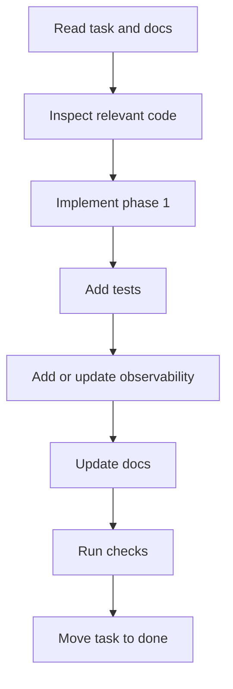
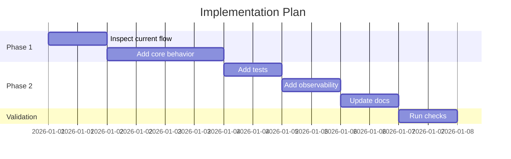

# AGENTS.md

## Purpose

This file defines how agents should work in this repository.

Main goal:

- Keep code reliable.
- Keep docs accurate.
- Keep tests green.
- Keep UI consistent.
- Keep observability complete.
- Avoid unnecessary process for small tasks.
- Scale process based on task size and risk.

---

## Big Rules

- Use Bun.
- Use TypeScript.
- Use English for technical work.
- Use i18n for user-facing text.
- Keep docs true.
- Keep tests green.
- Keep UI consistent.
- Keep changes small.
- Track work when the task type requires it.
- Use console logging and file logging as the default logging baseline.
- Use telemetry and analytics for all non-small production changes.
- Do not add process that does not reduce risk.

---

## Work Modes

Agents must classify each task before starting.

Use the lightest mode that is safe.

### Mode 1: Small Change

Use for:

- Typos.
- Small refactors.
- Simple config changes.
- Localized code cleanup.
- Small non-behavioral fixes.
- One-file or few-file changes.
- Low-risk changes with clear scope.

Required:

1. Read relevant file(s).
2. Make small focused safe changes.
3. Run the most relevant check only.
4. Preserve existing logging, telemetry, and analytics.
5. Update docs only if behavior, setup, API, UI, workflow, or observability changes.

Not required:

- Tasklist update.
- Plan.
- Risk document.
- Follow-up document.
- Full test suite.
- Full build.
- New telemetry.
- New analytics.
- New logging, unless the change directly affects logging or errors.
- PR template content.

Small changes must not remove, weaken, or bypass existing observability.

Escalate to Normal Change when:

- Behavior changes.
- Public API changes.
- UI behavior changes.
- Tests need new coverage.
- Logging behavior changes.
- Telemetry behavior changes.
- Analytics behavior changes.
- More than a few files are touched.
- The change affects multiple modules.

---

### Mode 2: Normal Change

Use for:

- Feature work.
- Behavior changes.
- API changes.
- User-visible changes.
- Production bug fixes.
- New validation logic.
- New tests.
- Moderate UI changes.
- Changes touching several related files.

Required:

1. Read `docs/dev/tasklist.md`.
2. Check if task exists.
3. Add task if missing.
4. Read relevant docs and code.
5. Understand impact.
6. Make small focused changes.
7. Add or update relevant tests.
8. Add or update telemetry for technical behavior, reliability, and performance.
9. Add or update analytics for product or user-flow behavior when applicable.
10. Update docs when behavior, API, setup, UI, workflow, or observability changes.
11. Run relevant checks.

Tasklist is required.

Plan is optional unless the change becomes large.

Escalate to Large Change when:

- Architecture changes.
- Multiple modules or domains are affected.
- Migration is needed.
- Security model changes.
- Auth or authorization changes.
- New dependency is added.
- i18n system changes.
- Logging architecture changes.
- Telemetry architecture changes.
- Analytics architecture changes.
- UI pattern or design system changes.
- Work is expected to be split into phases.

---

### Mode 3: Large Change

Use for:

- Architecture changes.
- Multi-module features.
- Data migrations.
- New subsystems.
- Security-sensitive work.
- Major UI flows.
- New shared UI patterns.
- Large refactors.
- Dependency strategy changes.
- Observability architecture changes.
- Work that needs phases.

Required:

1. Read `docs/dev/tasklist.md`.
2. Add or update task.
3. Create or update a plan in `docs/dev/plans/`.
4. Split work into phases.
5. Read relevant docs and code.
6. Identify affected modules.
7. Identify tests.
8. Identify docs impact.
9. Identify i18n impact.
10. Identify accessibility impact.
11. Identify security impact.
12. Identify telemetry impact.
13. Identify analytics impact.
14. Identify risks when real risks exist.
15. Identify follow-ups only when unfinished work remains.
16. Run full relevant checks before marking done.

Large changes must include an observability plan.

---

### Mode 4: Bug Fix

Use for:

- User-reported bugs.
- Regression fixes.
- Incorrect production behavior.
- Error handling fixes.
- Incorrect logging, telemetry, or analytics behavior.

Required:

1. Classify as Small, Normal, or Large.
2. If production behavior is affected, add or update tasklist item.
3. Reproduce the bug when possible.
4. Add a failing regression test when practical.
5. Confirm the test fails.
6. Fix the bug.
7. Confirm the test passes.
8. Add edge cases when useful.
9. Add or update telemetry for technical failure, recovery, latency, or reliability signals.
10. Add or update analytics when the bug affects a product or user journey.
11. Update docs only if behavior, troubleshooting, workflow, or observability changes.

Do not:

- Delete tests to pass.
- Ignore failing tests.
- Mark done without checking the fix.
- Add analytics for purely internal bugs unless product behavior is affected.

---

### Mode 5: UI Change

Use for:

- New UI.
- Changed UI behavior.
- New component.
- Changed component.
- New interaction.
- Changed layout.
- Design system changes.

Small UI changes may stay Small Change.

Normal or Large UI changes require planning.

Required for Normal UI Change:

1. Check existing components first.
2. Reuse or extend existing components when possible.
3. Use Tailwind.
4. Use shadcn/ui where appropriate.
5. Use shared components.
6. Use i18n for user-facing text.
7. Check keyboard behavior.
8. Check focus states.
9. Check loading, empty, and error states.
10. Add or update relevant tests.
11. Add telemetry for UI errors, performance, and reliability when applicable.
12. Add analytics for meaningful user actions and product flow events.
13. Update styleguide when reusable pattern changes.

Required for Large UI Change:

- Include an ASCII wireframe in the plan.
- Include affected states.
- Include accessibility notes.
- Include i18n notes.
- Include logging notes.
- Include telemetry notes.
- Include analytics notes.
- Include component reuse notes.
- Include screenshots in PR when available.

Example ASCII UI plan:

```txt
+--------------------------------------------------+
| Header                                           |
|--------------------------------------------------|
| Search input                  [Primary action]   |
|--------------------------------------------------|
| Filter chips                                      |
|  [All] [Active] [Archived]                        |
|--------------------------------------------------|
| Table                                             |
|  Name        Status        Actions                |
|  Item A      Active        [Edit] [Delete]        |
|  Item B      Error         [Retry] [Details]      |
|--------------------------------------------------|
| Empty state: shown when no results                |
| Error state: shown when fetch fails               |
+--------------------------------------------------+
```

Do not:

- Add one-off styling without reason.
- Hardcode colors.
- Hardcode user-facing strings.
- Create a new component when an existing one works.
- Make mouse-only interactions.
- Track every click without product value.
- Track sensitive input values.

---

### Mode 6: Docs-Only Change

Use for:

- Documentation edits.
- Clarifications.
- Setup instructions.
- Troubleshooting notes.
- User guides.
- Developer docs.

Required:

1. Read the relevant doc.
2. Check related code only when needed.
3. Keep docs accurate.
4. Keep technical docs in English.
5. Keep user docs appropriate for the target locale.
6. Update observability documentation when logging, telemetry, or analytics behavior is documented or changed.
7. Run docs check only when available and relevant.

Tasklist is not required for small docs-only changes.

Tasklist is required when:

- Docs describe new behavior.
- Docs are part of a tracked feature.
- Docs close a follow-up.
- Docs update architecture, setup, API, security, testing, UI patterns, logging, telemetry, or analytics.

Docs-only changes do not require new logging, telemetry, or analytics.

---

### Mode 7: PR / Release Preparation

Use when preparing final review or PR-ready work.

Required:

1. Confirm tasklist item exists when required by mode.
2. Confirm task status is correct.
3. Confirm related docs exist when required.
4. Confirm tests were added or updated when required.
5. Confirm logging impact is handled.
6. Confirm telemetry impact is handled.
7. Confirm analytics impact is handled.
8. Confirm risks and follow-ups are documented only if they exist.
9. Run applicable checks.
10. Prepare PR summary.

Recommended checks:

```bash
bun install
bun run format:check
bun run lint
bun run typecheck
bun test
bun run build
bun run docs:check
bun run i18n:check
```

Use real project scripts when different.

---

## Tasklist

Tasklist lives here:

```txt
docs/dev/tasklist.md
```

Archive lives here:

```txt
docs/dev/tasklistarchive.md
```

Tasklist is required for:

- Normal Change.
- Large Change.
- Production Bug Fix.
- Normal or Large UI Change.
- PR / Release Preparation.
- Any task with a plan.
- Any task with documented risks.
- Any task with documented follow-ups.
- Any non-small observability change.

Tasklist is not required for:

- Small Change.
- Small docs-only change.
- Typo fix.
- Local cleanup with no behavior change.
- Exploratory reading.

Each task needs:

- Status.
- Related document.
- Estimate.
- Very short description.

Use this format:

```md
| Status | Related document          | Estimated work | Description |
| ------ | ------------------------- | -------------: | ----------- |
| open   | docs/dev/plans/example.md |             4h | Add feature |
```

Allowed statuses:

| Status          | Meaning                     |
| --------------- | --------------------------- |
| `open`          | Known. Not started.         |
| `in-progress`   | Work happening.             |
| `needs-testing` | Code done. Checks not done. |
| `deferred`      | Later. Not now.             |
| `paused`        | Started. Blocked.           |
| `rejected`      | Will not do.                |
| `done`          | Finished and checked.       |

Keep max 50 `done` tasks in `docs/dev/tasklist.md`.

More than 50 `done` tasks? Move oldest 25 done tasks to:

```txt
docs/dev/tasklistarchive.md
```

Do not delete task history.

---

## Docs

Docs matter.

Update docs when change affects:

- Behavior.
- Architecture.
- API.
- Setup.
- Build.
- Tests.
- UI patterns.
- i18n.
- Accessibility.
- Security.
- User workflow.
- Troubleshooting.
- Logging.
- Telemetry.
- Analytics.
- Observability operations.

Do not update unrelated docs.

Code and docs disagree? Code is current. Fix docs when the task scope includes that area.

Missing docs? Create docs only when the change needs docs.

Confusing docs? Improve docs when they block or mislead the current task.

---

## Docs Structure

Use this shape:

```txt
docs/
  dev/
    tasklist.md
    tasklistarchive.md
    architecture/
    setup/
    testing/
    api/
    components/
    styleguide/
    decisions/
    plans/
      done/
    risks/
    follow-ups/
      done/
    troubleshooting/
    observability/
      logging.md
      telemetry.md
      analytics.md
    agents/
  user/
    guides/
    features/
    faq/
    troubleshooting/
    release-notes/
```

Developer docs explain how the system works.

User docs explain how the product is used.

Do not mix them.

---

## Plans

Plans are required for Large Change.

Plans are optional for Normal Change.

Plans are not required for Small Change unless explicitly requested.

Active plans go here:

```txt
docs/dev/plans/
```

Done plans go here:

```txt
docs/dev/plans/done/
```

Keep only active or unresolved plans in:

```txt
docs/dev/plans/
```

Move a plan to:

```txt
docs/dev/plans/done/
```

when the related task is `done`.

When moving a plan, update the tasklist `Related document` path.

Plan should say:

- Goal.
- Scope.
- Non-goals.
- Approach.
- Affected modules.
- Phases.
- Mermaid task/dependency diagram.
- Tests.
- Docs impact.
- i18n impact.
- Accessibility impact.
- Security impact.
- Logging impact.
- Telemetry impact.
- Analytics impact.
- Risks.
- Open questions.

Plan-backed task starts? Split into phases first.

Plan-backed task must have a tasklist item.

---

## Mermaid Planning

Large plans should include Mermaid.

Use Mermaid to show dependencies, phases, or flow.

Prefer `flowchart` for dependencies:



Use `gantt` for phased work:



Use Mermaid only when it clarifies the work.

Do not add diagrams for trivial work.

---

## UI Planning

Normal or Large UI work should include:

- Existing components checked.
- ASCII wireframe.
- Component list.
- State list.
- i18n impact.
- Accessibility impact.
- Logging impact.
- Telemetry impact.
- Analytics impact.
- Test impact.

UI plan template:

````md
## UI Plan

### Goal

...

### Existing components checked

- `ComponentA`
- `ComponentB`

### ASCII wireframe

```txt
+--------------------------------------+
| Title                                |
| Description                          |
|--------------------------------------|
| [Input]                              |
| [Cancel]                  [Submit]   |
+--------------------------------------+
```

### States

- Loading
- Empty
- Error
- Success
- Disabled
- Validation error

### i18n

- New keys:
  - `example.form.title`
  - `example.form.submit`
  - `example.form.error.invalidValue`

### Accessibility

- Keyboard navigation
- Visible focus
- Labels
- Error announcements
- Dialog behavior when relevant

### Observability

- Console logging:
  - Error boundary event
  - Recoverable submit failure
- File logging:
  - Server-side action failure
  - API validation failure
- Telemetry:
  - Render failure count
  - Submit latency
  - API request duration
- Analytics:
  - Form opened
  - Submit attempted
  - Submit succeeded
  - Submit failed without sensitive values

### Tests

- Component render test
- Interaction test
- Validation test
- Accessibility test when relevant
- Observability test when practical
````
---

## Observability

Observability includes:

- Console logging.
- File logging.
- Telemetry.
- Analytics.

Console logging and file logging are the baseline for runtime diagnostics.

Telemetry and analytics are required for all non-small production changes unless the change is docs-only or clearly has no runtime behavior.

Small changes must preserve existing observability but do not require new telemetry or analytics.

---

## Logging

Logging is for diagnostics, troubleshooting, operations, and support.

The application should support both:

- Console logging.
- File logging.

Use console logging for:

- Local development diagnostics.
- Container logs.
- Runtime startup and shutdown events.
- Important operational events.
- Warnings and errors.
- Non-sensitive debugging signals.

Use file logging for:

- Durable diagnostics.
- Production troubleshooting.
- Background jobs.
- Imports and exports.
- Scheduled tasks.
- Server-side errors.
- Security-relevant operational events.
- Integration failures.
- Long-running processes.

Logs must be structured when practical.

Prefer fields such as:

```ts
{
  event: "product.import.failed",
  level: "error",
  requestId,
  jobId,
  userIdHash,
  durationMs,
  errorCode,
}
```

Do not log:

- Passwords.
- Tokens.
- API keys.
- Session IDs.
- Raw authorization headers.
- Personal data unless explicitly allowed and minimized.
- Full user input payloads.
- Sensitive commercial data.
- Stack traces shown to end users.

Stack traces may be logged internally only when safe.

Expected production errors should have:

- Stable error code.
- Clear developer message.
- Localized user-facing message when shown to users.
- Console log when operationally relevant.
- File log when durable diagnostics are useful.
- Test coverage.
- Docs when useful.

---

## Telemetry

Telemetry is for technical health, reliability, and performance.

Use telemetry for:

- Request duration.
- Job duration.
- Queue depth.
- Error count.
- Retry count.
- Timeout count.
- External API latency.
- Database query timing when useful.
- Cache hit or miss rate.
- Background worker health.
- Import/export throughput.
- Resource usage when relevant.

Telemetry events and metrics must:

- Use stable names.
- Use consistent dimensions.
- Avoid high-cardinality labels.
- Avoid sensitive values.
- Be documented when added or changed.
- Be tested when practical.

Good telemetry names:

```txt
api.request.duration_ms
job.run.duration_ms
job.run.failed_count
import.products.processed_count
external.pimcore.request.duration_ms
```

Bad telemetry names:

```txt
thing_happened
slow_stuff
user_123_clicked_button
full_payload_size_for_customer_acme
```

Telemetry is required for Normal and Large production changes.

Telemetry is not required for Small Change unless the change directly affects telemetry or operational behavior.

---

## Analytics

Analytics is for product behavior and user-flow understanding.

Use analytics for:

- Feature discovery.
- User journey steps.
- Conversion or completion events.
- Important button or form submissions.
- Import/export funnel events.
- Search/filter usage.
- Onboarding steps.
- Non-sensitive product usage behavior.

Analytics events must:

- Use stable names.
- Have clear product meaning.
- Avoid personal data.
- Avoid raw search text unless explicitly approved.
- Avoid raw form values.
- Avoid secrets, tokens, and IDs that identify a person directly.
- Include only useful properties.
- Be documented when added or changed.
- Be tested when practical.

Good analytics names:

```txt
product_import_started
product_import_completed
product_search_filter_applied
onboarding_step_completed
article_mapping_saved
```

Bad analytics names:

```txt
click
button_pressed
john_uploaded_file
search_query_submitted_with_raw_text
```

Analytics is required for Normal and Large product or user-flow changes.

Analytics is not required for Small Change unless the change directly affects analytics.

For backend-only changes, analytics is required only when product behavior or user journeys are affected.

---

## Observability Documentation

Observability docs live here:

```txt
docs/dev/observability/
```

Recommended files:

```txt
docs/dev/observability/logging.md
docs/dev/observability/telemetry.md
docs/dev/observability/analytics.md
```

Update observability docs when:

- New logging conventions are introduced.
- Log destinations change.
- Log formats change.
- Telemetry metric names change.
- Analytics event names change.
- Privacy or retention behavior changes.
- Debugging or troubleshooting procedures change.

---

## Observability Testing

Add or update tests when practical for:

- Error logs.
- Audit-relevant logs.
- Telemetry emitted on success.
- Telemetry emitted on failure.
- Analytics emitted on meaningful user actions.
- Analytics not emitted with sensitive values.
- Logging redaction.
- Stable event names.

Do not create brittle tests that depend on incidental debug output.

Prefer testing stable logger, telemetry, or analytics interfaces.

---

## Privacy and Data Protection

Logging, telemetry, and analytics must follow data minimization.

Before adding any event or property, ask:

- Is this needed?
- Can this be aggregated?
- Can this be hashed?
- Can this be replaced by a stable non-sensitive code?
- Does this create high cardinality?
- Could this expose personal, commercial, or security-sensitive data?

Never send sensitive data to analytics.

Never use analytics as an error log.

Never use telemetry as a data warehouse for user content.

Never rely on client-side tracking for security.

---

## Risks

Risks go here:

```txt
docs/dev/risks/
```

Risk documents are required only when a real risk exists.

Use risks for:

- Security uncertainty.
- Data migration uncertainty.
- Performance uncertainty.
- Breaking change uncertainty.
- Third-party integration uncertainty.
- Unresolved architectural trade-off.
- Observability coverage uncertainty.
- Analytics privacy uncertainty.
- Telemetry cardinality or cost uncertainty.

Risk should say:

- Description.
- Impact.
- Likelihood.
- Mitigation.
- Owner or area.
- Status.

Risk gone? Update docs.

Do not create risk docs for routine work.

No stale risks.

---

## Follow-Ups

Active follow-ups go here:

```txt
docs/dev/follow-ups/
```

Done follow-ups go here:

```txt
docs/dev/follow-ups/done/
```

Create follow-ups only when useful work remains and cannot be completed now.

Do not create follow-ups for vague ideas.

Keep only active or unresolved follow-ups in:

```txt
docs/dev/follow-ups/
```

Move a follow-up to:

```txt
docs/dev/follow-ups/done/
```

when the remaining work is finished.

When moving a follow-up, update related tasklist or docs references.

Follow-up should say:

- What remains.
- Why not done now.
- Next step.
- Related files or docs.
- Status.

Follow-up needs future work? Add tasklist item.

Do not mention follow-up in final answer unless it is documented.

---

## Language

Use English for:

- Code.
- Comments.
- Tests.
- Commits.
- PRs.
- Technical docs.
- Developer docs.
- API names.
- Error codes.
- Config.
- CLI output keys.
- Log event names.
- Telemetry metric names.
- Analytics event names.

Localized content allowed for:

- UI text.
- Labels.
- Help text.
- Validation messages.
- User guides for a locale.
- Support conversations.
- Localized examples.

User-facing text must use i18n.

No hardcoded user-facing strings.

---

## i18n

Translation keys must be stable and clear.

Good:

```txt
auth.login.title
auth.login.submit
auth.login.error.invalidCredentials
```

Bad:

```txt
title
button1
errorMessage
text
```

English is primary fallback language.

Missing translations must fail checks when i18n checks exist.

i18n checks are required when:

- User-facing text changes.
- New UI is added.
- Validation messages change.
- Error messages shown to users change.
- Locale files change.

---

## Bun

Use Bun unless project says otherwise.

Prefer:

```bash
bun install
bun run dev
bun run build
bun test
bun run lint
bun run typecheck
bun run format
```

Avoid:

- npm.
- yarn.
- pnpm.
- Node-only tooling.

Use other tooling only with documented reason.

---

## Platforms

Project must work on:

- macOS.
- Linux.
- Windows.

Avoid:

- Bash-only scripts.
- OS-specific paths.
- Hardcoded absolute paths.
- Platform-specific env syntax.
- Shell tricks that break on Windows.

Prefer:

- Bun scripts.
- TypeScript scripts.
- `path.join`.
- `path.resolve`.
- `Bun.env`.
- Explicit platform handling.

---

## Code

Code must be:

- Simple.
- Typed.
- Readable.
- Testable.
- Maintainable.
- Explicit about errors.
- Consistent with architecture.
- Observable in production where relevant.

Avoid:

- `any`.
- Unsafe casts.
- Hidden side effects.
- Global mutable state.
- Duplicated logic.
- Magic values.
- Silent failures.
- Huge files.
- Mixed UI and business logic.
- Hardcoded user-facing strings.
- Unstructured production logs.
- Analytics without product meaning.
- Telemetry with sensitive or high-cardinality labels.

---

## Errors

Errors must be intentional.

Expected production error needs:

- Stable code.
- Developer explanation.
- Localized user message when shown to user.
- Console log when operationally relevant.
- File log when durable diagnostics are useful.
- Telemetry when reliability or performance is affected.
- Analytics when product or user-flow behavior is affected.
- Test.
- Docs when useful.

Never show users:

- Stack traces.
- Secrets.
- Tokens.
- Internal details.

User error message must be:

- Clear.
- Useful.
- Localized.
- Consistent.

---

## Tests

Production behavior needs tests.

Use the right test level:

- Unit.
- Integration.
- Component.
- End-to-end.
- Regression.
- Accessibility.
- i18n.
- Error tests.
- Observability tests.

Bug from user? Prefer red-green:

1. Write failing test.
2. See it fail.
3. Fix bug.
4. See it pass.
5. Add edge cases if useful.
6. Document if useful.

Do not delete tests to pass build.

Do not ignore failing tests.

Exception? Document why in the task, plan, or PR notes.

---

## Test Names

Test names use English.

Good:

```ts
it("shows a localized validation message when the email address is invalid", () => {});
```

Good observability test names:

```ts
it("records telemetry when the import job fails", () => {});
it("does not include raw input values in analytics events", () => {});
it("writes a file log entry when the export worker times out", () => {});
```

Bad:

```ts
it("test error", () => {});
it("logs stuff", () => {});
```

---

## UI

Use:

- Tailwind.
- shadcn/ui.
- Shared components.
- Design tokens.
- Consistent spacing.
- Consistent typography.
- Consistent colors.
- Consistent icons.
- Consistent states.

Avoid:

- One-off styles.
- Inline styles without reason.
- Hardcoded colors.
- Duplicate variants.
- Random spacing.
- Random buttons.
- New components when old component works.

Before new component:

1. Check existing components.
2. Reuse or extend if possible.
3. Follow shadcn/ui.
4. Keep small.
5. Separate presentation and logic.
6. Add tests.
7. Add analytics for meaningful user actions when this is not a Small Change.
8. Add telemetry for performance, loading, or error behavior when useful.
9. Add docs when reusable pattern changes.

---

## Styleguide

Styleguide lives here:

```txt
docs/dev/styleguide/
```

Update it when reusable UI pattern changes.

Styleguide should cover:

- Colors.
- Typography.
- Spacing.
- Icons.
- Buttons.
- Forms.
- Tables.
- Cards.
- Dialogs.
- Navigation.
- Loading states.
- Empty states.
- Error states.
- Responsive behavior.
- Accessibility.
- Analytics expectations for reusable patterns.
- Examples.

Do not update styleguide for one-off UI fixes unless they reveal a reusable rule.

---

## Accessibility

UI must be accessible.

Need:

- Semantic HTML.
- Keyboard navigation.
- Visible focus.
- Labels.
- Good contrast.
- Screen-reader friendly errors.
- Accessible dialogs.
- Accessible menus.
- Accessible popovers.

Do not make mouse-only UI.

New interactive component needs accessibility check.

Small visual-only UI changes need only relevant accessibility checks.

---

## Performance

Think performance.

Prefer:

- Small bundles.
- Lazy loading.
- Fewer re-renders.
- Efficient data fetching.
- Clear loading states.
- Measured optimization.
- Telemetry before and after major performance changes.

Do not add heavy dependency without reason.

Document big performance decisions.

Do not prematurely optimize small changes.

---

## Security

Validate:

- User input.
- API responses.
- Env vars.
- File paths.
- URLs.
- Auth state.
- Authorization.
- Log fields.
- Telemetry dimensions.
- Analytics properties.

Avoid:

- Logging secrets.
- Exposing tokens.
- Client-only security.
- Unsafe HTML.
- Unsafe redirects.
- Leaking internals.
- Sending personal or sensitive data to analytics.
- Using raw user input in telemetry labels.

Security behavior needs tests.

Security-sensitive changes require Normal or Large mode.

---

## Dependencies

Before dependency:

1. Check existing solution.
2. Prefer small package.
3. Check maintenance.
4. Check Bun support.
5. Check browser/server support.
6. Check bundle size.
7. Document reason.

No dependency for trivial work.

New runtime dependency requires Normal or Large mode.

Large or risky dependency requires a plan.

Logging, telemetry, or analytics dependencies require:

- Documented reason.
- Privacy review.
- Failure-mode behavior.
- Configuration documentation.
- Tests when practical.

---

## Git

Commits use English.

Prefer conventional commits:

```txt
feat: add localized onboarding flow
fix: handle invalid product import files
test: add regression test for upload validation
docs: update developer testing guide
refactor: simplify translation loading
```

One commit = one focused change.

Do not mix unrelated work.

---

## Pull Requests

PR should say what applies:

- What changed.
- Why changed.
- Tests.
- Docs.
- Tasklist item.
- Task status.
- Estimate review.
- Plans.
- Risks.
- Follow-ups.
- Archive maintenance.
- Screenshots for UI.
- i18n impact.
- Accessibility impact.
- Logging impact.
- Telemetry impact.
- Analytics impact.
- Known limits.
- Migration notes.

Before ready PR, run applicable checks.

Recommended full PR checks:

```bash
bun install
bun run format:check
bun run lint
bun run typecheck
bun test
bun run build
bun run docs:check
bun run i18n:check
```

`bun run docs:check` enforces when available:

- Every active plan in `docs/dev/plans/`, excluding `docs/dev/plans/done/`, is referenced from `docs/dev/tasklist.md`.
- No `done` plan remains in `docs/dev/plans/`; move it to `docs/dev/plans/done/`.
- No completed follow-up remains in `docs/dev/follow-ups/`; move it to `docs/dev/follow-ups/done/`.
- `docs/dev/tasklist.md` keeps at most 50 `done` rows.
- Every `job.kind` registered via the per-domain `register…Handler` helpers wired in `src/server/index.ts` appears in `docs/dev/architecture/job-inventory.md`.
- Same diff also runs from `tests/docs/job-inventory.test.ts`.

Use real project scripts if different.

---

## Done Criteria by Mode

### Small Change Done

Done when:

- Relevant code or docs changed.
- Relevant targeted check passed when available.
- Existing logging, telemetry, and analytics were not weakened.
- No unrelated changes.
- Docs updated only if needed.

---

### Normal Change Done

Done when applicable items are true:

- Task exists in `docs/dev/tasklist.md`.
- Status is correct.
- Related doc exists when required.
- Estimate exists.
- Short description exists.
- Code complete.
- Tests added or updated.
- Bug has regression test when practical.
- Error states tested when affected.
- Telemetry exists for technical behavior, reliability, or performance when relevant.
- Analytics exists for product or user-flow behavior when relevant.
- i18n used when user-facing text changed.
- UI follows styleguide when UI changed.
- Accessibility checked when UI changed.
- Developer docs updated when needed.
- User docs updated when needed.
- Relevant checks pass.
- No unrelated changes.

---

### Large Change Done

Done when applicable items are true:

- Task exists in `docs/dev/tasklist.md`.
- Plan exists in `docs/dev/plans/` or `docs/dev/plans/done/`.
- Plan contains phases.
- Plan contains Mermaid diagram.
- Plan contains observability impact.
- Task status is correct.
- Related doc exists.
- Estimate exists.
- Short description exists.
- Code complete.
- Tests added or updated.
- Regression tests added when fixing bugs.
- Error states tested.
- Telemetry implemented or explicitly accounted for.
- Analytics implemented or explicitly accounted for.
- Observability docs updated when needed.
- i18n impact handled.
- UI follows styleguide when UI changed.
- Accessibility checked when UI changed.
- Developer docs updated.
- User docs updated when user workflow changed.
- Plans updated.
- Done plans moved to `docs/dev/plans/done/`.
- Risks updated when risks exist.
- Follow-ups updated when follow-ups exist.
- Done follow-ups moved to `docs/dev/follow-ups/done/`.
- Format passes.
- Lint passes.
- Typecheck passes.
- Tests pass.
- Build passes.
- Archive done if more than 50 done tasks.
- No unrelated changes.

---

## Agent Must

- Classify the task mode first.
- Use the lightest safe process.
- Read tasklist when the mode requires it.
- Track work when the mode requires it.
- Read relevant docs.
- Read relevant code.
- Make small focused changes.
- Test changes at the right level.
- Update docs when needed.
- Update task status when tasklist is required.
- Keep i18n for user-facing text.
- Keep UI consistent.
- Keep accessibility for UI.
- Keep security for sensitive flows.
- Add or update telemetry for non-small technical production changes.
- Add or update analytics for non-small product or user-flow changes.
- Keep build green.
- Explain assumptions.
- Mention only documented risks and follow-ups.

---

## Agent Must Not

- Treat every task as Large Change.
- Start tracked work without checking tasklist when the mode requires tasklist.
- Ignore failing tests.
- Remove tests to pass.
- Bypass i18n.
- Hardcode user text.
- Add visual one-off without reason.
- Silently change public behavior.
- Skip required docs.
- Remove or weaken existing logging without reason.
- Remove or weaken existing telemetry without reason.
- Remove or weaken existing analytics without reason.
- Log secrets, tokens, or sensitive payloads.
- Send personal or sensitive data to analytics.
- Use high-cardinality telemetry labels.
- Leave stale plans.
- Leave done plans in `docs/dev/plans/`.
- Leave stale risks.
- Leave stale follow-ups.
- Leave completed follow-ups in `docs/dev/follow-ups/`.
- Leave stale tasklist entries.
- Delete completed task history.
- Keep more than 50 done tasks in active tasklist.
- Run full-process overhead for small safe changes.
- Repeat actions in the same task if there have been no changes