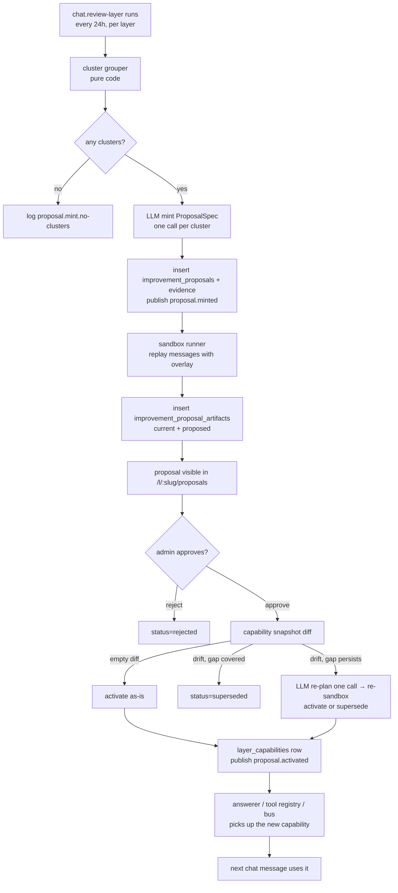

# Self-learning, user-verified

> Status: living document.
> Owners: phase 7 introduced this; phase 8 will swap the
> activation gate from "admin approval" to threshold automation
> without re-shaping the data model.
> Source code: `apps/server/src/proposals/`,
> `apps/server/src/chat/review-layer-handler.ts`,
> `apps/server/src/http/routes/layer-proposals.ts`,
> `apps/server/src/http/routes/layer-capabilities.ts`,
> `apps/server/src/storage/migrations/0015_proposals.sql`,
> `packages/shared/src/proposals.ts`,
> `apps/web/src/pages/LayerProposalsListPage.tsx`,
> `apps/web/src/pages/LayerProposalDetailPage.tsx`,
> `apps/web/src/pages/LayerCapabilitiesPage.tsx`,
> `apps/web/src/dashboard/ProposalsWidget.tsx`.
> Tests under `apps/server/tests/proposals-*.test.ts`,
> `apps/server/tests/http-layer-proposals.test.ts`,
> `apps/server/tests/http-layer-capabilities.test.ts`,
> and the phase-7.7 smoke block in
> `apps/server/tests/smoke.test.ts`.

This is the single-page tour of bunny2's self-learning loop.
Companion to [`chat-pipeline.md`](./chat-pipeline.md),
[`retrieval.md`](./retrieval.md),
[`event-bus.md`](./event-bus.md),
[`scheduled-tasks.md`](./scheduled-tasks.md),
[`overview.md`](./overview.md), and ADRs
[`0023`](../decisions/0023-improvement-proposal-contract.md)
(proposal data model + lifecycle),
[`0024`](../decisions/0024-sandbox-runner.md) (sandbox boundary)
and [`0025`](../decisions/0025-replan-on-approval.md) (the
re-plan + activation rules).

---

## 1. Why this exists

`overall.md` §5 invariant 9 fixes the rule for phase 7:

> Every change the system proposes goes through a **verification
> gate** before it lands. A proposal is a hypothesis; activation
> requires either explicit admin approval (phase 7) or a passed
> automation threshold (phase 8).

The loop turns the telemetry the chat pipeline already collects
(`chat_messages`, `chat_pipeline_steps`,
`chat_message_feedback`, `llm_calls`) into reviewed, gated
improvements to that same pipeline. The exit criterion is the
phase-7 promise: a human-approved skill / tool / agent makes it
from proposal → sandbox → activation, and the next chat answer
actually uses it.

---

## 2. The four moving parts

```
                 chat pipeline (phase 6) ──────────────────────┐
                   │ writes telemetry: messages, feedback,     │
                   │ pipeline-steps, llm-calls                 │
                   ▼                                           │
            cluster grouper (pure code, deterministic)         │
                   │                                           │
                   ▼                                           │
            proposal minter (one LLM call per cluster)         │
                   │                                           │
                   ▼                                           │
            sandbox runner (replay against an in-memory        │
            capability overlay; current vs proposed)           │
                   │                                           │
                   ▼                                           │
            admin reviews / approves / rejects                 │
                   │                                           │
                   ▼                                           │
            capability re-inspector (snapshot diff; activate   │
            as-is / re-plan once / supersede)                  │
                   │                                           │
                   ▼                                           │
            layer_capabilities row + per-layer registry  ──────┘
                                                               │
                                                               ▼
                                                next chat run sees it
```

- **Cluster grouper** (`apps/server/src/proposals/clusters.ts`)
  — pure code, no LLM. Groups telemetry into failure-mode
  clusters: `zero-hit-retrieval`, `thumbs-down`,
  `latency-over-budget`, `repeated-error-code`,
  `invalid-step-output`. Deterministic ordering so the same
  telemetry always produces the same clusters.
- **Proposal minter** (`apps/server/src/proposals/mint.ts`) —
  one LLM call per cluster. Output is a wrapper
  `{ spec, expectedImpact, threshold }`; `spec` is the closed-enum
  `ProposalSpec` from ADR 0023 §2. Parse failure retries once
  internally, then skips with `event: 'proposal.mint.skipped'`.
- **Sandbox runner**
  (`apps/server/src/proposals/sandbox/runner.ts`) — replays the
  evidence messages against (a) the current pipeline and (b) the
  pipeline with an in-memory capability overlay carrying the
  proposed artifact. Writes two `improvement_proposal_artifacts`
  rows (`current` + `proposed`) with transcripts and delta
  metrics. Hard 10-second timeout per replay.
- **Capability re-inspector / re-plan**
  (`apps/server/src/proposals/replan.ts`) — runs on approval.
  Diffs the mint-time snapshot against the live capability set
  and routes to one of four outcomes (see §4).

---

## 3. Data model overview

Four new tables (migration `0015_proposals.sql`). Full schema
lives in ADR [`0023`](../decisions/0023-improvement-proposal-contract.md);
the relationship sketch:

```
              improvement_proposals
              ├─ id (uuid, PK)
              ├─ layer_id  ─────────────────► layers
              ├─ status (enum)
              ├─ artifact_kind (tool|skill|agent)
              ├─ proposed_spec_json (zod ProposalSpec)
              ├─ expected_impact_json
              ├─ threshold (REAL; phase-8 seam)
              ├─ capability_snapshot_json (mint-time baseline)
              └─ minted_by_run_id ──────────► scheduled_task_runs
                       ▲                                    ▲
                       │                                    │
   improvement_proposal_evidence       improvement_proposal_artifacts
   ├─ proposal_id (FK)                 ├─ proposal_id (FK)
   ├─ message_id ──► chat_messages     ├─ variant (current|proposed|replanned)
   ├─ cluster_reason                   ├─ transcript_json
   └─ detail_json                      ├─ metrics_json
                                       └─ ran_at

              layer_capabilities  (per-layer activated registry)
              ├─ id (uuid, PK)
              ├─ layer_id  ─────────────────► layers
              ├─ kind (tool|skill|agent)
              ├─ name
              ├─ spec_json (the live spec)
              ├─ origin ('builtin' | 'proposal:<uuid>')
              ├─ activated_at
              ├─ deactivated_at (soft-delete)
              └─ UNIQUE(layer_id, kind, name)
```

zod schemas mirror this shape in
`packages/shared/src/proposals.ts`. `threshold` is recorded on
every proposal but never read by activation in phase 7 — phase 8
is the consumer.

---

## 4. The two activation gates

Phase 7 enforces two gates between a clustered failure mode and
an active capability:

1. **Mint gate** — the review agent mints the proposal but the
   spec is treated as a hypothesis. The proposal status starts
   `new`; the sandbox writes evidence rows; the proposal becomes
   visible in `/l/:slug/proposals` for the layer admin.
2. **Approve gate** — `POST /l/:slug/proposals/:id/approve`
   (admin-only) calls `replanOnApproval(...)`. This is where
   re-plan happens:
   - **`activated-asis`** — empty snapshot diff. The mint-time
     spec activates verbatim. One `layer_capabilities` row,
     `proposal.activated` bus event, proposal status → `activated`.
   - **`superseded`** — the live snapshot already covers the
     cluster's failure-mode tags (drift-since-mint added a
     capability whose `addressesTags` ⊇ the proposal's). No
     activation. `proposal.superseded` bus event, status →
     `superseded`.
   - **`activated-replanned`** — capabilities drifted but the gap
     persists. One re-plan LLM call regenerates the spec; the
     sandbox re-runs against the new spec; on positive
     `thumbsUpDelta` the regenerated spec activates. A third
     `improvement_proposal_artifacts` row (`variant='replanned'`)
     captures the new transcript.
   - **`superseded-after-replan`** — the regenerated spec's
     sandbox is non-positive or times out. No activation; status
     → `superseded` with the audit-trail artifact row preserved.

Both gates write structured logs + bus events; ADR 0025 §2 fixes
the diff algorithm ("covers the gap" = the cluster's failure-mode
tags are all addressed by capabilities present in the current
snapshot but absent at mint time).

---

## 5. The closed-enum handler-kind model

Every `ProposalSpec` is a discriminated union over
`artifactKind`, and each branch's executable surface is a closed
enum of `handler.kind` strings:

| artifactKind | handler.kind values                                          |
| ------------ | ------------------------------------------------------------ |
| `tool`       | `searchSummaries-aliased`, `projection-lookup`               |
| `skill`      | (no handler — the spec carries the prompt fragment + intent) |
| `agent`      | `enrichment-call`, `summary-call`                            |

No field on a `ProposalSpec` is ever interpreted as code. The
proposal LLM is constrained at mint time to emit only handler
kinds in the enum; the spec is zod-validated at mint, at sandbox,
and again at activation. Adding a new handler kind is an explicit
code change in a future sub-phase — never something a proposal
can inject. This is the central security choice that makes the
in-process sandbox boundary defensible.

The rule is recorded in ADR
[`0023`](../decisions/0023-improvement-proposal-contract.md) §2
(contract) and ADR
[`0024`](../decisions/0024-sandbox-runner.md) §2 (sandbox
enforcement).

---

## 6. Capability registry + overlay

The per-layer capability registry
(`apps/server/src/proposals/capability-registry.ts`) is the
single source of truth for "what tools / skills / agents does
layer X have right now?". It reads from `layer_capabilities`
rows where `deactivated_at IS NULL`. Three consumers:

- The **answerer step** calls `loadSkillFragments(registry,
layerId, intent)` and appends each fragment as an additional
  `system` message between the hard grounding prompt and the
  retrieval JSON. Order is `activatedAt` ascending so re-runs
  produce stable prompts.
- The **tool registry surface** exposes
  `listTools(layerId)` for the future tool-calling answerer (a
  phase-7+ follow-up; the v1 answerer is still hard-coded).
- The **agent subscriber wrapper** re-attaches per-layer `agent`
  subscribers to the durable bus on activation, and detaches them
  on deactivate. Boot recovery in `apps/server/src/index.ts`
  re-attaches every active `agent` row on startup (mirroring how
  scheduled tasks re-seed).

The sandbox runner consults the registry via an **in-memory
capability overlay** — a `Map<(kind, name), spec>` read-through
that the per-layer registry treats as authoritative for the
duration of a sandbox run. Sandbox runs see the overlay; nothing
else does. This is what makes "replay with proposed spec
attached" possible without persisting any code or activating
anything halfway. ADR
[`0024`](../decisions/0024-sandbox-runner.md) §1 documents the
contract.

---

## 7. Scheduled tasks

Phase 7 ships three handler kinds (see
[`job-inventory.md`](./job-inventory.md)):

- **`chat.review-layer`** (phase-6 placeholder body replaced) —
  per-layer review-agent run. Iterates every non-deleted layer
  in-process; for each layer it groups telemetry, mints
  proposals, runs the sandbox, and writes the rows the UI
  surfaces. Cadence: every 24 h. **Touches LLM**: yes (mint call
  per cluster).
- **`proposals.evidence.prune`** — retention sweep. Deletes
  `improvement_proposal_evidence` + `improvement_proposal_artifacts`
  rows older than the configured TTL (default 90 d). Mirrors
  `chat.runs.prune`. Cadence: every 24 h. Touches LLM: no.
- **`proposals.replan-stale`** — idempotent re-run of mint + sandbox
  for every `new` proposal older than 7 d whose capability snapshot
  has drifted from the live one. Keeps the UI's evidence fresh
  without an admin click. Cadence: every 24 h. Touches LLM: yes
  (re-sandbox can call the real LLM in production).

All three are seeded as `everyone`-scoped `scheduled_tasks`
rows on first boot.

---

## 8. Forward note for phase 8

The `threshold` field on every proposal is the **seam phase 8
consumes**. Phase 7 records it (the mint LLM emits it; the UI
shows it as informational) but the activation path always
requires an explicit admin click. Phase 8 will flip a single
gate — "if `threshold >= configured cutoff`, skip the approval
click and run the re-plan + activation path" — without
re-shaping any data, any HTTP route, or any UI page. The
audit-trail tables (`improvement_proposal_artifacts`,
`layer_capabilities.origin`) are designed to support phase 8's
rollback UI without further migrations.

Other deferred work has dedicated follow-ups (see
`docs/dev/follow-ups/`): tool-calling answerer that consumes
the registered tool kinds (`chat-tool-calling-answerer.md`),
conversation auto-summary (`chat-conversation-auto-summary.md`),
the chat page's `?message=:id` deep-link
(`chat-page-message-deep-link.md`).

---

## 9. End-to-end flow (Mermaid, mirrors plan §15)



---

## 10. Observability

Stable event names (logged via `ctx.logger`, mirrored in
`docs/dev/observability/`):

- Review-agent: `proposal.mint.cluster`,
  `proposal.mint.persist`, `proposal.mint.skipped`,
  `proposal.mint.no-clusters`.
- Sandbox: `proposal.sandbox.replay`,
  `proposal.sandbox.complete`.
- Re-plan: `proposal.replan.outcome` (closed-enum dimension:
  `activated-asis | activated-replanned | superseded |
superseded-after-replan`).

Telemetry counter dimensions are bounded — outcome labels and
artifact kinds are closed enums; never use proposal id or
message id as a label.

Analytics events (placeholder primitive until the
`web-analytics-primitive.md` follow-up lands):
`proposals_page_opened`, `proposal_detail_opened`,
`proposal_approved`, `proposal_rejected`,
`proposal_sandbox_replayed`. Proposal id is opaque; no sensitive
values.

---

## 11. Related docs

- ADRs [`0023`](../decisions/0023-improvement-proposal-contract.md),
  [`0024`](../decisions/0024-sandbox-runner.md),
  [`0025`](../decisions/0025-replan-on-approval.md).
- [`docs/dev/plans/done/phase-07-self-learning.md`](../plans/done/phase-07-self-learning.md)
  — the full plan + the per-sub-phase outputs.
- [`docs/user/guides/improvement-proposals.md`](../../user/guides/improvement-proposals.md)
  — the layer-admin-facing guide.
- [`chat-pipeline.md`](./chat-pipeline.md) — the pipeline the
  review loop reviews.
- [`retrieval.md`](./retrieval.md) §5 — the read path that powers
  every replay.
