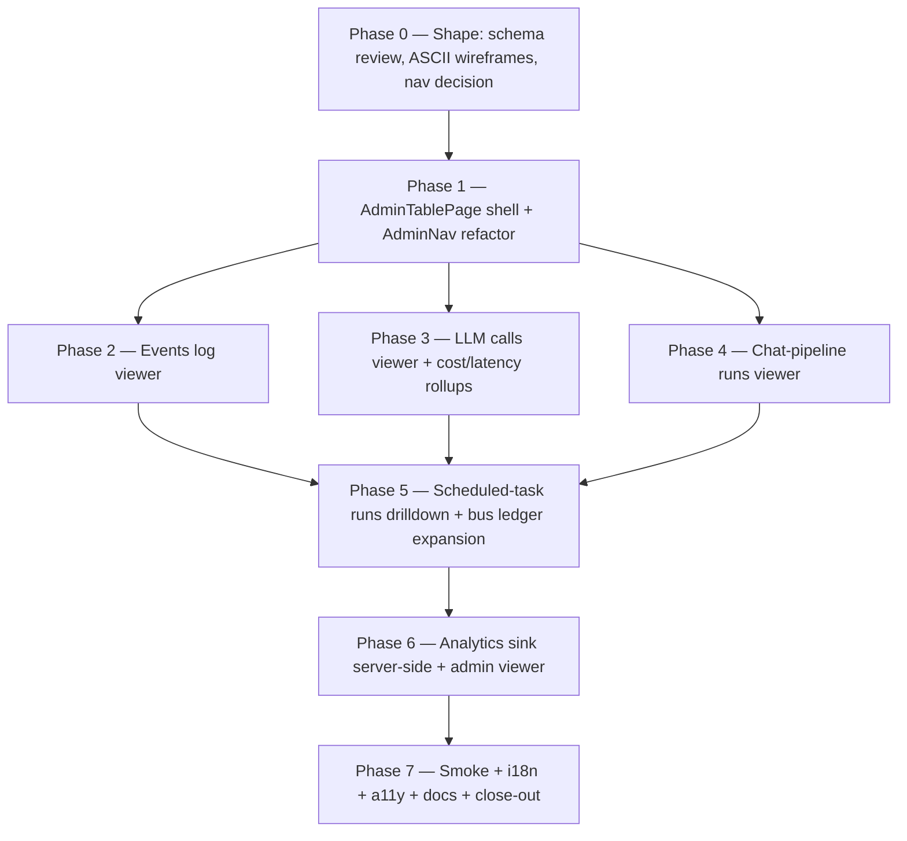

# Admin observability viewer

> Status: open.
> Owner: admin surface + observability cross-cut.
> Mode: Large Change — new admin sections, new (small)
> server-side analytics sink, multi-phase work.
> Background:
>
> - [`docs/dev/observability/logging.md`](../observability/logging.md)
> - [`docs/dev/observability/telemetry.md`](../observability/telemetry.md)
> - [`docs/dev/observability/analytics.md`](../observability/analytics.md)
> - [`docs/dev/audits/ui-route-exposure-audit-2026-05-25.md`](../audits/ui-route-exposure-audit-2026-05-25.md)

## 1. Goal

Give a system admin a single in-app surface to read the
project's runtime signals — **logs**, **telemetry**, and
**analytics** — without dropping to a SQL shell or container
stdout. Today the data is queryable but only via direct
`sqlite3` access and `console.log` tails. Admins should be able
to:

1. Browse the canonical **events log** with filters (kind, time
   range, layer, flow_id, correlation_id).
2. Inspect **LLM calls** end-to-end (redacted request +
   response, tokens, cost, latency, flow trace).
3. Walk a **chat-pipeline run** step by step.
4. See **scheduled-task run history** with errors and durations
   (existing `AdminScheduledTasksPage` extended).
5. Read the **bus outbox / DLQ** ledger (existing
   `AdminBusDlqPage` extended for non-DLQ rows).
6. Browse **analytics events** for product-flow insight
   (requires shipping the server-side sink first — currently
   `trackEvent` is a no-op per
   [`analytics.md`](../observability/analytics.md)).

After this plan ships, every observability table from
[`telemetry.md §1`](../observability/telemetry.md) has a paired
admin viewer, and the analytics sink is no longer "deferred".

## 2. Scope

In scope:

- Read-only admin views for each surface above. Filter +
  drilldown UI; no edit capability except DLQ replay (already
  partially supported).
- Server-side `analytics_events` SQLite table + ingest endpoint
  - `configureAnalytics` wiring in `apps/web/src/main.tsx` to
    post events to it.
- Prune jobs for any new tables (analytics events retention).
- Privacy: every viewer surfaces **already-redacted** rows;
  redaction is enforced at write time as today. No new
  PII surfaces.

Non-goals:

- Replacing the durable sink with files / external collectors
  (logging.md notes the trade-off explicitly).
- Real-time tailing / WebSocket push. The viewers are
  paginated reads with a manual refresh button (server-sent
  events can be a follow-up if needed).
- Cross-instance log aggregation. Single-server / single-
  desktop only.
- Editing or deleting rows from `events`, `llm_calls`, or
  `analytics_events` from the UI. Pruning stays in scheduled
  jobs.
- A full BI dashboard. Aggregations are limited to "rolling
  24h / 7d / 30d count + latency p50/p95" per view.
- Exporting raw data as CSV / JSON from the UI (small
  follow-up if asked).
- Per-layer non-admin access. Observability stays admin-only;
  per-layer "my AI usage" dashboards are a separate future
  decision.

## 3. Approach

Each surface gets one page under `apps/web/src/pages/admin/`,
following the existing `AdminBusDlqPage` / `AdminUsersPage`
pattern (header + filters + table + pagination + detail
drawer). All pages share a small `<AdminTablePage>` shell that
we extract from the existing two as part of phase 1.

Server-side: the data already lives in SQLite. We add **read-
only** endpoints under `/admin/observability/*` with cursor
pagination and stable filter parameters. Analytics is the only
write-path addition: `POST /analytics/events` (web client) +
`analytics_events` table + retention job.

The admin top-nav grows a single **Observability** dropdown
(or a secondary nav row when more than ~3 admin sections fit
in the bar; we'll evaluate during phase 1 against the existing
header). Per `AGENTS.md §UI` we reuse shadcn `DropdownMenu`
rather than invent a custom menu.

## 4. Affected modules

Server:

- `apps/server/src/http/routes/admin-observability.ts` (new) —
  events, LLM calls, chat pipeline runs.
- `apps/server/src/http/routes/admin-scheduled-tasks.ts` (extend
  with per-task runs endpoint — overlaps with
  `ui-exposure-gaps.md` phase 4; whichever plan ships the
  endpoint first satisfies both).
- `apps/server/src/http/routes/analytics.ts` (new) — POST
  ingest, GET admin list.
- `apps/server/src/storage/migrations/` — new migration for
  `analytics_events` table + retention column.
- `apps/server/src/scheduled/` — `analytics.events.prune` task
  registration + handler.
- `apps/server/src/index.ts` — wire the new admin route +
  scheduled task (matches the per-domain `register…Handler`
  pattern enforced by `docs/check`).

Web:

- `apps/web/src/components/admin/AdminTablePage.tsx` (new
  shell — extracted from existing pages).
- `apps/web/src/components/admin/AdminNav.tsx` (new — or
  inline expansion of the App.tsx header).
- `apps/web/src/pages/admin/AdminEventsPage.tsx` (new).
- `apps/web/src/pages/admin/AdminLlmCallsPage.tsx` (new).
- `apps/web/src/pages/admin/AdminChatRunsPage.tsx` (new).
- `apps/web/src/pages/admin/AdminAnalyticsPage.tsx` (new).
- `apps/web/src/lib/api.ts` (helpers).
- `apps/web/src/lib/analytics.ts` (configure the real sink).
- `apps/web/src/main.tsx` (wire `configureAnalytics({ sink:
httpAnalyticsSink })`).
- `apps/web/src/locales/{en,nl}.json`.
- `apps/web/src/App.tsx` (routes + nav entries).

Docs:

- `docs/dev/observability/analytics.md` — remove "no sink by
  default" caveat once the sink ships; document the local
  table sink.
- `docs/dev/observability/logging.md` — link the new events
  viewer; reaffirm "no file sink" decision.
- `docs/dev/observability/telemetry.md` — link the LLM /
  chat-runs viewers.
- `docs/dev/architecture/job-inventory.md` — add
  `analytics.events.prune` row (required by `docs:check`).
- `docs/user/guides/admin-observability.md` (new) — admin
  walkthrough.

## 5. Phases

### Phase 0 — Shape (est. 3h)

- Walk each source table, confirm the field set we want to
  expose (and the field set we deliberately hide — e.g.
  raw `llm_calls.request` JSON is huge and pre-redacted; it
  must collapse behind an expander, not render inline).
- ASCII wireframes per page (per `AGENTS.md §UI Planning`).
- Decide nav shape: extra header buttons vs an
  "Observability" `DropdownMenu`. Recommendation: dropdown,
  because we will end up with 4 new admin pages.
- ADR stub for analytics sink (local SQLite vs external).
  Recommended: local SQLite, consistent with logging.md's
  "durable SQLite tables" stance — file under
  `docs/dev/decisions/0031-analytics-local-sink.md`.

### Phase 1 — Shell + nav (est. 3h)

- Extract `<AdminTablePage>` from `AdminBusDlqPage` /
  `AdminScheduledTasksPage` (header, filters, table,
  pagination). No behaviour change for the two existing
  pages — pure refactor, covered by their existing smoke
  tests.
- Add `<AdminNav>` (dropdown) and integrate into header.
- i18n: `admin.nav.observability` + reorganized labels.

### Phase 2 — Events log viewer (est. 5h)

- `GET /admin/observability/events` with cursor pagination
  and filters: `kind` (LIKE prefix), `from`, `to`,
  `layerId`, `flowId`, `correlationId`.
- `AdminEventsPage`: table + filter form + detail drawer
  (full JSON payload pre-formatted).
- Telemetry: query latency emitted as `admin.events.query`.
- Tests: smoke + filter parser unit tests.

### Phase 3 — LLM calls viewer (est. 6h)

- `GET /admin/observability/llm-calls` — filters: `model`,
  `endpoint`, `layerId`, `userId`, `status` (ok / err),
  `from`, `to`, `costMin`, `latencyMaxMs`.
- Detail drawer: request / response JSON (collapsed by
  default, virtualized when large), tokens, cost, latency,
  `model_source`, links to the matching `events` row by
  `correlation_id`.
- Rollups card on top: rolling 24h / 7d count, total cost,
  p50 / p95 latency, error rate. Aggregations server-side
  (cheap on indexed columns).
- Telemetry: `admin.llm-calls.query` latency.
- Tests: smoke + rollup math.

### Phase 4 — Chat-pipeline runs viewer (est. 5h)

- `GET /admin/observability/chat-runs` — filters per
  `chat_pipeline_steps`.
- Drilldown: per-run step timeline (Gantt-ish list — each
  step's duration + status + error), with the matching
  `llm_calls` rows surfaced via `correlation_id`.
- Tests: smoke + drilldown render.

### Phase 5 — Scheduled-task runs + bus ledger (est. 4h)

- Extend `AdminScheduledTasksPage` with a per-task "Runs"
  drilldown (overlaps with `ui-exposure-gaps.md` phase 4 —
  share the endpoint).
- Extend `AdminBusDlqPage` (or split into `AdminBusOutboxPage`
  - `AdminBusDlqPage`) so admins can also see in-flight /
    delivered outbox rows, not just DLQ.

### Phase 6 — Analytics sink + viewer (est. 8h)

- Migration: `analytics_events` table —
  `(id, occurred_at, event_name, layer_slug, user_id_hash,
properties_json, ingested_at)`.
- `POST /analytics/events` with shape validation against the
  documented catalogue in `analytics.md`. Reject unknown
  event names (or accept them under a `_unknown_` bucket — to
  be decided in phase 0 ADR).
- Server-side hash of `user_id` before persist (no raw user
  id in analytics, per `analytics.md §Privacy`).
- `configureAnalytics({ sink: httpAnalyticsSink })` in
  `apps/web/src/main.tsx`; sink batches + retries on
  failure but never throws.
- `AdminAnalyticsPage`: table + filter form + per-event-name
  rollups (24h / 7d count). Detail drawer shows the
  documented property schema next to the row's values to
  catch drift.
- Scheduled task `analytics.events.prune` (default 90d
  retention, configurable per env).
- Update `analytics.md` — remove "deferred" language; document
  the table + endpoint.
- Tests: ingest happy path, ingest reject unknown event,
  redaction sanity (no raw search text reaches storage),
  prune job, viewer smoke.

### Phase 7 — Smoke + i18n + a11y + docs + close-out (est. 4h)

- Full smoke run.
- i18n parity check (en / nl).
- a11y pass on every new admin page (keyboard, focus,
  contrast).
- User guide `docs/user/guides/admin-observability.md`.
- ADR 0031 accepted.
- Move plan to `docs/dev/plans/done/`.

## 6. Tests

- Per phase as listed.
- New regression tests:
  - Analytics endpoint rejects unknown event names (or buckets
    per ADR).
  - Analytics events never store raw user content (assert on
    `properties_json` field set).
  - Admin viewers gate on `isAdmin` server-side; non-admin
    fetch returns 403.
  - Pagination cursor stability under concurrent inserts.

## 7. Docs impact

- `docs/dev/observability/{logging,telemetry,analytics}.md` —
  update links and remove deferred-sink language.
- `docs/dev/architecture/job-inventory.md` — add
  `analytics.events.prune`.
- `docs/dev/decisions/0031-analytics-local-sink.md` (new ADR).
- `docs/user/guides/admin-observability.md` (new user guide).

## 8. i18n impact

New namespaces:

- `admin.nav.observability`
- `admin.events.*`
- `admin.llmCalls.*`
- `admin.chatRuns.*`
- `admin.analytics.*`

All keys land in both `en.json` and `nl.json`.

## 9. Accessibility impact

- Tables: column headers (`<th scope="col">`), sortable
  headers operate via keyboard (`aria-sort`), row expansion
  via button.
- Detail drawer: focus trap on open, ESC closes, focus
  returns to trigger row.
- Filter form: real form semantics, labels associated, errors
  announced via `aria-live="polite"`.
- Long JSON payloads: rendered in a `<pre>` with
  `tabindex="0"` so screen reader users can navigate them;
  collapse / expand button labelled.
- Color is never the only signal for error / ok status.

## 10. Security impact

- Every endpoint behind `requireAdmin` middleware (already
  exists at `apps/server/src/http/middleware/admin.ts`).
- Analytics ingest validates against the catalogue to prevent
  free-form payload injection.
- `user_id` hashed before persist; raw id never leaves memory.
- Detail drawer renders pre-redacted JSON only; no
  unredacted path exists server-side.
- No new auth flow; no new token store.
- Privacy review captured in the ADR.

## 11. Logging impact

- Each new admin endpoint logs `admin.observability.<table>.query`
  on entry with the filter set (no row content).
- Analytics ingest logs `analytics.events.rejected` for
  unknown / invalid events, with the event name only.
- No PII added to logs.

## 12. Telemetry impact

New metric rows on `events`:

- `admin.observability.events.query`
- `admin.observability.llm-calls.query`
- `admin.observability.chat-runs.query`
- `admin.observability.analytics.query`
- `analytics.events.ingested`
- `analytics.events.rejected`
- `analytics.events.pruned`

All low-cardinality (no per-user / per-event-name labels
beyond what is already public).

## 13. Analytics impact

This plan ships the analytics sink itself. Existing
`trackEvent('chat_message_sent', …)` etc. start landing in
`analytics_events` once `main.tsx` wires the sink. No
re-naming of existing events; the catalogue in
`analytics.md` stays the source of truth.

## 14. Risks

- **R1: Analytics ingest endpoint becomes an abuse target.**
  Unauthenticated POSTs from a browser tab make it spammable.
  Mitigation: authenticated-session-only (reuse `requireAuth`
  middleware, not `requireAdmin`); rate-limit at edge; cap
  body size; reject unknown event names.
- **R2: `events` table size in production.**
  The viewer queries can be expensive if `events` grows past
  a few million rows. Mitigation: every filter column is
  indexed; pagination is cursor-based; rollup queries use
  pre-aggregated rolling-window subqueries with explicit
  index hints when needed.
- **R3: JSON payload rendering crashes the page** on a
  multi-MB `llm_calls.request`. Mitigation: server truncates
  > 200 KB with an explicit "truncated; full payload
  > available via API" marker; viewer renders only first N
  > rows / chars by default with an explicit expander.
- **R4: Admin viewer exposes data we thought was redacted but
  isn't.** Mitigation: phase 0 includes a redaction audit
  per surface; tests assert no raw user content in sampled
  rows; ADR documents the redaction guarantees.
- **R5: Local-sink ADR is the wrong default for cloud
  deployments.** Mitigation: keep `configureAnalytics`
  pluggable; the local sink is the default, not the only
  option; the ADR explicitly leaves the door open.

## 15. Open questions

- **Q1: Should analytics ingest accept unknown event names**
  (bucketed under `_unknown_` for catalogue-drift detection)
  or reject them outright? — Resolved in phase 0 ADR.
- **Q2: Per-layer "my AI usage" dashboard for non-admins** —
  out of scope; logged here so it doesn't surprise anyone.
- **Q3: Real-time tail / SSE** for events and LLM calls —
  out of scope; revisit if admins ask after using the
  paginated view.
