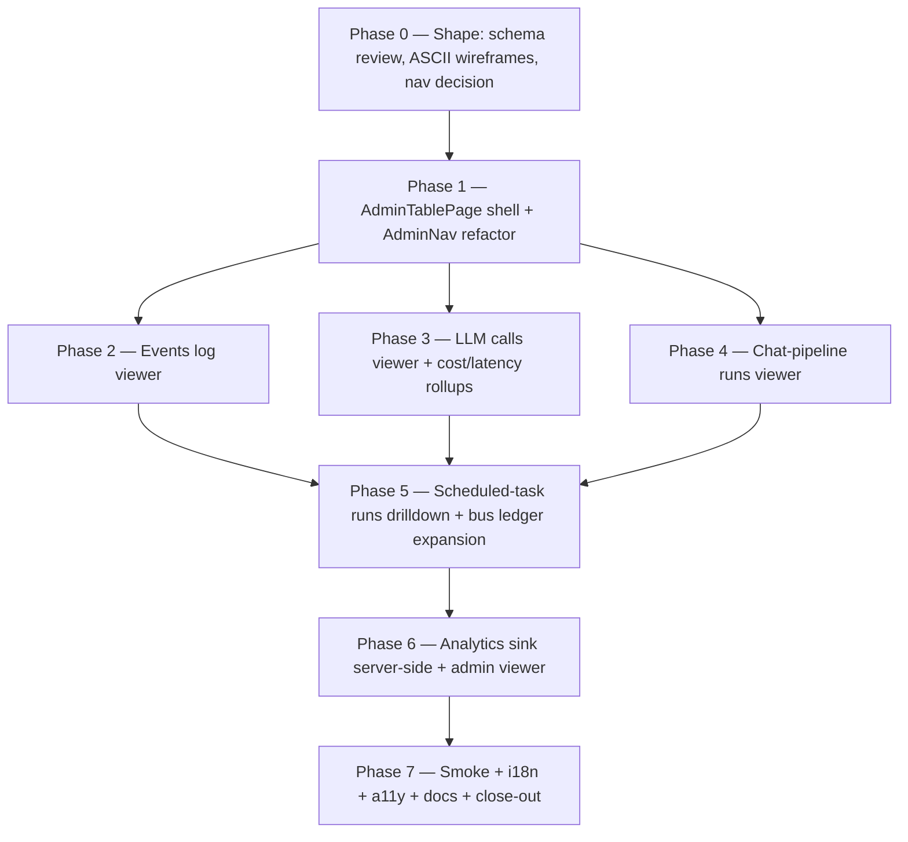

# Admin observability viewer

> Status: open.
> Owner: admin surface + observability cross-cut.
> Mode: Large Change — new admin sections, new (small)
> server-side analytics sink, multi-phase work.
> Background:
>
> - [`docs/dev/observability/logging.md`](../observability/logging.md)
> - [`docs/dev/observability/telemetry.md`](../observability/telemetry.md)
> - [`docs/dev/observability/analytics.md`](../observability/analytics.md)
> - [`docs/dev/audits/ui-route-exposure-audit-2026-05-25.md`](../audits/ui-route-exposure-audit-2026-05-25.md)

## 1. Goal

Give a system admin a single in-app surface to read the
project's runtime signals — **logs**, **telemetry**, and
**analytics** — without dropping to a SQL shell or container
stdout. Today the data is queryable but only via direct
`sqlite3` access and `console.log` tails. Admins should be able
to:

1. Browse the canonical **events log** with filters (kind, time
   range, layer, flow_id, correlation_id).
2. Inspect **LLM calls** end-to-end (redacted request +
   response, tokens, cost, latency, flow trace).
3. Walk a **chat-pipeline run** step by step.
4. See **scheduled-task run history** with errors and durations
   (existing `AdminScheduledTasksPage` extended).
5. Read the **bus outbox / DLQ** ledger (existing
   `AdminBusDlqPage` extended for non-DLQ rows).
6. Browse **analytics events** for product-flow insight
   (requires shipping the server-side sink first — currently
   `trackEvent` is a no-op per
   [`analytics.md`](../observability/analytics.md)).

After this plan ships, every observability table from
[`telemetry.md §1`](../observability/telemetry.md) has a paired
admin viewer, and the analytics sink is no longer "deferred".

## 2. Scope

In scope:

- Read-only admin views for each surface above. Filter +
  drilldown UI; no edit capability except DLQ replay (already
  partially supported).
- Server-side `analytics_events` SQLite table + ingest endpoint
  - `configureAnalytics` wiring in `apps/web/src/main.tsx` to
    post events to it.
- Prune jobs for any new tables (analytics events retention).
- Privacy: every viewer surfaces **already-redacted** rows;
  redaction is enforced at write time as today. No new
  PII surfaces.

Non-goals:

- Replacing the durable sink with files / external collectors
  (logging.md notes the trade-off explicitly).
- Real-time tailing / WebSocket push. The viewers are
  paginated reads with a manual refresh button (server-sent
  events can be a follow-up if needed).
- Cross-instance log aggregation. Single-server / single-
  desktop only.
- Editing or deleting rows from `events`, `llm_calls`, or
  `analytics_events` from the UI. Pruning stays in scheduled
  jobs.
- A full BI dashboard. Aggregations are limited to "rolling
  24h / 7d / 30d count + latency p50/p95" per view.
- Exporting raw data as CSV / JSON from the UI (small
  follow-up if asked).
- Per-layer non-admin access. Observability stays admin-only;
  per-layer "my AI usage" dashboards are a separate future
  decision.

## 3. Approach

Each surface gets one page under `apps/web/src/pages/admin/`,
following the existing `AdminBusDlqPage` / `AdminUsersPage`
pattern (header + filters + table + pagination + detail
drawer). All pages share a small `<AdminTablePage>` shell that
we extract from the existing two as part of phase 1.

Server-side: the data already lives in SQLite. We add **read-
only** endpoints under `/admin/observability/*` with cursor
pagination and stable filter parameters. Analytics is the only
write-path addition: `POST /analytics/events` (web client) +
`analytics_events` table + retention job.

The admin top-nav grows a single **Observability** dropdown
(or a secondary nav row when more than ~3 admin sections fit
in the bar; we'll evaluate during phase 1 against the existing
header). Per `AGENTS.md §UI` we reuse shadcn `DropdownMenu`
rather than invent a custom menu.

## 4. Affected modules

Server:

- `apps/server/src/http/routes/admin-observability.ts` (new) —
  events, LLM calls, chat pipeline runs.
- `apps/server/src/http/routes/admin-scheduled-tasks.ts` (extend
  with per-task runs endpoint — overlaps with
  `ui-exposure-gaps.md` phase 4; whichever plan ships the
  endpoint first satisfies both).
- `apps/server/src/http/routes/analytics.ts` (new) — POST
  ingest, GET admin list.
- `apps/server/src/storage/migrations/` — new migration for
  `analytics_events` table + retention column.
- `apps/server/src/scheduled/` — `analytics.events.prune` task
  registration + handler.
- `apps/server/src/index.ts` — wire the new admin route +
  scheduled task (matches the per-domain `register…Handler`
  pattern enforced by `docs/check`).

Web:

- `apps/web/src/components/admin/AdminTablePage.tsx` (new
  shell — extracted from existing pages).
- `apps/web/src/components/admin/AdminNav.tsx` (new — or
  inline expansion of the App.tsx header).
- `apps/web/src/pages/admin/AdminEventsPage.tsx` (new).
- `apps/web/src/pages/admin/AdminLlmCallsPage.tsx` (new).
- `apps/web/src/pages/admin/AdminChatRunsPage.tsx` (new).
- `apps/web/src/pages/admin/AdminAnalyticsPage.tsx` (new).
- `apps/web/src/lib/api.ts` (helpers).
- `apps/web/src/lib/analytics.ts` (configure the real sink).
- `apps/web/src/main.tsx` (wire `configureAnalytics({ sink:
httpAnalyticsSink })`).
- `apps/web/src/locales/{en,nl}.json`.
- `apps/web/src/App.tsx` (routes + nav entries).

Docs:

- `docs/dev/observability/analytics.md` — remove "no sink by
  default" caveat once the sink ships; document the local
  table sink.
- `docs/dev/observability/logging.md` — link the new events
  viewer; reaffirm "no file sink" decision.
- `docs/dev/observability/telemetry.md` — link the LLM /
  chat-runs viewers.
- `docs/dev/architecture/job-inventory.md` — add
  `analytics.events.prune` row (required by `docs:check`).
- `docs/user/guides/admin-observability.md` (new) — admin
  walkthrough.

## 5. Phases



### Phase 0 — Shape (est. 3h) — DONE 2026-05-25

- Walk each source table, confirm the field set we want to
  expose (and the field set we deliberately hide — e.g.
  raw `llm_calls.request` JSON is huge and pre-redacted; it
  must collapse behind an expander, not render inline).
- ASCII wireframes per page (per `AGENTS.md §UI Planning`).
- Decide nav shape: extra header buttons vs an
  "Observability" `DropdownMenu`. Recommendation: dropdown,
  because we will end up with 4 new admin pages.
- ADR stub for analytics sink (local SQLite vs external).
  Recommended: local SQLite, consistent with logging.md's
  "durable SQLite tables" stance — file under
  `docs/dev/decisions/0031-analytics-local-sink.md`.

#### Phase 0 — outcomes

Deliverables produced 2026-05-25:

- **ADR** —
  [`docs/dev/decisions/0031-analytics-local-sink.md`](../decisions/0031-analytics-local-sink.md).
  Decisions: (D1) local `analytics_events` SQLite table is the
  sink; (D2) ingest **rejects** unknown event names per the
  catalogue in `analytics.md` (Q1 resolved); (D3) `user_id`
  hashed server-side at ingest (`user_id_hash`), deliberate
  asymmetry with `llm_calls.user_id` which keeps the raw UUID;
  (D4) 90-day default retention via `analytics.events.prune`;
  (D5) viewer relies on the redaction guarantees catalogued
  in the audit linked below.
- **Redaction audit** —
  [`docs/dev/audits/admin-observability-redaction-2026-05-25.md`](../audits/admin-observability-redaction-2026-05-25.md).
  Two load-bearing findings:
  1. `chat_pipeline_steps.input_json` for the `intent` /
     `entities` step contains the raw user message by design.
     The phase-4 viewer gates that field behind an explicit
     "show raw chat content" expander; viewing it is logged
     as `admin.observability.chat-runs.raw-content.viewed`
     (row id only, no content).
  2. `analytics_events.properties_json` must be
     catalogue-bounded at ingest; without that validation the
     new table would become the same "possible raw content"
     surface as the others.
- **Nav decision:** **dropdown**. The current
  `apps/web/src/App.tsx` header already shows 4 admin
  buttons (Users, Groups, Scheduled Tasks, Bus DLQ). Phase 6
  adds 4 more — that would crowd the header past usable. Phase
  1 ships an `<AdminNav>` using shadcn `DropdownMenu`,
  collapsing all admin entries under a single "Admin" label
  with a per-section heading inside (Users & Groups, Tasks &
  Bus, Observability). i18n key:
  `admin.nav.observability` + sibling section headings.
- **Field exposure rules:** see the per-table breakdown in the
  redaction audit. Headline rules:
  - `events.payload` / `.metadata`: drawer only, collapsed.
  - `llm_calls.request` / `.response`: drawer only, collapsed;
    server truncates payloads > 200 KB (R3).
  - `chat_pipeline_steps.input_json` (intent + entities):
    drawer only, behind an explicit "show raw chat content"
    toggle.
  - `chat_pipeline_steps.output_json` (answer step):
    metadata-only by writer design (`contentBytes`, not the
    text). Safe inline-collapse.
  - `bus_outbox.payload_json` / `metadata_json`: drawer only.
  - `analytics_events.properties_json`: inline OK because the
    catalogue keeps content bounded.

#### Phase 0 — ASCII wireframes

Each wireframe assumes the phase-1 `<AdminTablePage>` shell:
page header (title + refresh button) → filter form → table →
detail drawer. The shell wraps shadcn `Table`, `Drawer` (or
`Sheet`), `Input`, `Select`, `Button`.

##### Admin · Observability · Events log (phase 2)

```txt
+--------------------------------------------------------------------+
| Admin · Observability · Events log               [Refresh]         |
| Read-only view of the canonical event log.                         |
|--------------------------------------------------------------------|
| Filters                                                            |
|  Kind prefix [_______________]   From [2026-05-24T00:00]           |
|  Layer       [▼ select layer ]   To   [2026-05-25T23:59]           |
|  Flow id     [_______________]   Correlation id [_______________]  |
|                                                  [Apply] [Reset]   |
|--------------------------------------------------------------------|
| Occurred at        | Type                 | Layer | Flow | Corr id |
| 2026-05-25 14:02  | chat.message.done    | demo  | f-12 | c-9a    |
| 2026-05-25 14:01  | chat.step.started    | demo  | f-12 | c-9a    |
| 2026-05-25 13:58  | bus.dlq.added        | ops   | -    | c-7b    |
| ...                                                                |
|                                       [Prev]  page cursor  [Next]  |
|--------------------------------------------------------------------|
| Empty:   "No events match the current filters."                    |
| Error:   "Could not load events. [Retry]"                          |
| Loading: skeleton rows                                             |
+--------------------------------------------------------------------+

Drawer (row click):
+--------------------------------------------------------------------+
| chat.message.done                                          [Close] |
| id: ev_01HABC… · occurred 2026-05-25T14:02:11Z                     |
| correlation: c-9a · flow: f-12 · layer: demo                       |
|--------------------------------------------------------------------|
| Payload                                          [Expand JSON ▾]   |
|   { "conversationId": "…", "runId": "…", "latencyMs": 1820 }      |
|--------------------------------------------------------------------|
| Metadata                                         [Expand JSON ▾]   |
+--------------------------------------------------------------------+
```

##### Admin · Observability · LLM calls (phase 3)

```txt
+--------------------------------------------------------------------+
| Admin · Observability · LLM calls                [Refresh]         |
|--------------------------------------------------------------------|
| Rollups (rolling 24h / 7d):                                        |
|   Count: 1,204 / 9,872   Cost: $4.81 / $38.20                      |
|   p50 latency: 612 ms    p95 latency: 2.1 s                        |
|   Error rate: 0.3% / 0.4%                                          |
|--------------------------------------------------------------------|
| Filters                                                            |
|  Model    [▼ all]   Endpoint [▼ all]   Status [▼ all]              |
|  Layer    [▼ all]   User     [▼ all]                               |
|  From [...]  To [...]  Cost ≥ [..]  Latency ≤ [..] ms              |
|                                                  [Apply] [Reset]   |
|--------------------------------------------------------------------|
| Started at       | Model       | Endpoint | Tok in/out | Cost  | ms |
| 14:02:11         | claude-…    | /messages| 1024 / 256 | 0.012 | 1820 |
| 14:01:55         | gpt-4o-mini | /chat    |  812 / 134 | 0.004 |  712 |
|                                                                    |
|                                       [Prev]  page cursor  [Next]  |
+--------------------------------------------------------------------+

Drawer (row click):
+--------------------------------------------------------------------+
| LLM call · claude-3-5-sonnet                              [Close]  |
| Started 14:02:11 · 1820 ms · $0.012 · model_source: layer          |
| correlation: c-9a · flow: f-12 · layer: demo · user: u-7b          |
|--------------------------------------------------------------------|
| Request (redacted; > 200 KB will show "[truncated]")               |
|   [Expand JSON ▾]                                                  |
|--------------------------------------------------------------------|
| Response (redacted)                                                |
|   [Expand JSON ▾]                                                  |
|--------------------------------------------------------------------|
| Linked events: 4 rows by correlation_id  [Open events viewer →]    |
+--------------------------------------------------------------------+
```

##### Admin · Observability · Chat-pipeline runs (phase 4)

```txt
+--------------------------------------------------------------------+
| Admin · Observability · Chat-pipeline runs       [Refresh]         |
|--------------------------------------------------------------------|
| Filters                                                            |
|  Layer   [▼ all]   User [▼ all]                                    |
|  Status  [▼ all]   From [...]  To [...]                            |
|                                                  [Apply] [Reset]   |
|--------------------------------------------------------------------|
| Run started     | Conv id    | Status    | Steps | Duration | LLM  |
| 14:02:09        | conv-aa12  | succeeded | 4/4   | 1.9 s    | 1    |
| 13:58:01        | conv-bb33  | failed    | 2/4   | 0.7 s    | 1    |
|                                                                    |
|                                       [Prev]  page cursor  [Next]  |
+--------------------------------------------------------------------+

Drawer (row click):
+--------------------------------------------------------------------+
| Chat pipeline run · conv-aa12 / run-99                  [Close]    |
| Started 14:02:09 · ended 14:02:10.9 · status: succeeded            |
|--------------------------------------------------------------------|
| Step timeline                                                       |
|   intent     ────────  succeeded  90 ms   llm: llm-call-1          |
|   entities   ───────── succeeded 140 ms   llm: llm-call-2          |
|   retrieval  ──        succeeded  60 ms   (no llm)                 |
|   answer     ───────────────────── succeeded 1.6 s  llm: llm-call-3|
|--------------------------------------------------------------------|
| Per-step detail (click a row above)                                |
|   intent.output_json   [Expand JSON ▾]                             |
|   intent.input_json    [⚠ Show raw chat content ▸]                 |
|     (Toggling this reveals the user's typed message.)              |
+--------------------------------------------------------------------+
```

##### Admin · Observability · Analytics events (phase 6)

```txt
+--------------------------------------------------------------------+
| Admin · Observability · Analytics events         [Refresh]         |
|--------------------------------------------------------------------|
| Rollups (24h / 7d count per top-5 event names):                    |
|   chat_message_sent       412 / 3,109                              |
|   proposal_approved        34 /   201                              |
|   capability_deactivated    8 /    27                              |
|--------------------------------------------------------------------|
| Filters                                                            |
|  Event name [▼ all]   Layer [▼ all]                                |
|  From [...]   To [...]                                             |
|                                                  [Apply] [Reset]   |
|--------------------------------------------------------------------|
| Occurred at      | Event                  | Layer | User hash       |
| 14:02:11         | chat_message_sent      | demo  | 4f3a…           |
| 14:01:50         | proposal_approved      | demo  | 4f3a…           |
|                                                                    |
|                                       [Prev]  page cursor  [Next]  |
+--------------------------------------------------------------------+

Drawer (row click):
+--------------------------------------------------------------------+
| chat_message_sent · 2026-05-25T14:02:11Z                  [Close]  |
| Layer: demo · user_id_hash: 4f3a…                                  |
|--------------------------------------------------------------------|
| Documented properties (from analytics.md)                           |
|   layerSlug:       string                                          |
|   conversationId:  stable id                                       |
|   lengthBucket:    enum  (S | M | L)                               |
|--------------------------------------------------------------------|
| This row's properties                                              |
|   { "layerSlug": "demo", "conversationId": "…",                    |
|     "lengthBucket": "S" }                                          |
+--------------------------------------------------------------------+
```

##### Admin top-nav (phase 1)

```txt
Before (today):
+--------------------------------------------------------------------+
| Bunny2 · Layer demo  [Status][Chat][Layers][Users][Groups]         |
|                      [Scheduled tasks][Bus DLQ]            [User▾] |
+--------------------------------------------------------------------+

After (phase 1):
+--------------------------------------------------------------------+
| Bunny2 · Layer demo  [Status][Chat][Layers]    [Admin ▾]   [User▾] |
+--------------------------------------------------------------------+
                                              │
                                              ▼
                       +-----------------------------+
                       | Admin                       |
                       |   Users & Groups            |
                       |   · Users                   |
                       |   · Groups                  |
                       |   Operations                |
                       |   · Scheduled tasks         |
                       |   · Bus DLQ / outbox        |
                       |   Observability             |
                       |   · Events                  |
                       |   · LLM calls               |
                       |   · Chat pipeline runs      |
                       |   · Analytics               |
                       +-----------------------------+
```

### Phase 1 — Shell + nav (est. 3h)

- Extract `<AdminTablePage>` from `AdminBusDlqPage` /
  `AdminScheduledTasksPage` (header, filters, table,
  pagination). No behaviour change for the two existing
  pages — pure refactor, covered by their existing smoke
  tests.
- Add `<AdminNav>` (dropdown) and integrate into header.
- i18n: `admin.nav.observability` + reorganized labels.

### Phase 2 — Events log viewer (est. 5h)

- `GET /admin/observability/events` with cursor pagination
  and filters: `kind` (LIKE prefix), `from`, `to`,
  `layerId`, `flowId`, `correlationId`.
- `AdminEventsPage`: table + filter form + detail drawer
  (full JSON payload pre-formatted).
- Telemetry: query latency emitted as `admin.events.query`.
- Tests: smoke + filter parser unit tests.

#### Phase 2 — outcomes

Shipped 2026-05-25:

- **Endpoint:** `GET /admin/observability/events` —
  `apps/server/src/http/routes/admin-observability.ts`. Filters:
  `kind` (LIKE prefix, `%`/`_`/`\` escaped via `ESCAPE '\'`), `from`,
  `to`, `layerId`, `flowId`, `correlationId`, `limit` (cap 200,
  default 50), `cursor`. Cursor is `base64url(JSON({ts,id}))`;
  pagination uses the SQLite row-value comparison
  `(occurred_at, id) < (?, ?)` ordered DESC so a row inserted
  between page calls neither duplicates nor skips a paginated row.
  ISO TEXT comparison throughout (the plan's "ms epoch" wording
  was wrong — `events.occurred_at` is ISO TEXT per
  `0001_init.sql`).
- **Route:** `/admin/observability/events` —
  `apps/web/src/pages/admin/AdminEventsPage.tsx`.
  Wired into `App.tsx` behind `isAdmin`, exposed in `AdminNav`
  under a new "Observability" section (the section header was
  reserved in phase 1; this phase populates the first item).
- **Telemetry name:** `admin.observability.events.query` —
  published as a bus event (telemetry in this project is bus
  events on the `events` table per
  `docs/dev/observability/telemetry.md` §4) with
  `{ durationMs, rowCount, filterKeys, limit, hasCursor }`. Closed
  catalogue lives in `apps/server/src/observability/events.ts` so a
  typo in a producer fails the typecheck. Note: every viewer query
  writes one such row into the same table the viewer reads. That's
  acceptable — no recursion (handlers don't re-trigger the query)
  and the rows are catalogue-bounded.
- **Entry log:** `console.log('[admin.observability.events.query]',
…)` with the active filter-key set (NOT values) + row count +
  duration_ms.
- **Tests:** `apps/server/tests/http-admin-observability.test.ts`
  covers (a) filter parser unit + cursor round-trip, (b) listing
  newest-first, (c) cursor stability with a concurrent insert,
  (d) LIKE-prefix escapes user-supplied `%`, (e) non-admin →
  `403 errors.admin.forbidden`, (f) entry log + telemetry event
  emitted with stable shape.
- **i18n:** new `admin.events.*` namespace + `admin.nav.events` +
  `errors.admin.observability.*` keys, en + nl.
- **Deviation from the wireframe:** the detail drawer reuses the
  existing native-`<dialog>`-based `Dialog` component (focus trap,
  ESC dismiss, focus return for free). No new `Drawer` /
  `Sheet` primitive — the plan's wireframe header said "Drawer"
  but §3 noted "shadcn Drawer (or Sheet)" and there is no Radix
  dependency in the codebase yet. JSON payload renders in a
  `<pre tabindex="0">` per §9 a11y. The filter form omits the
  `aria-live` validation region — Phase 2 has no client-side
  validation that produces a message, so an empty live region
  would only add screen-reader noise.

### Phase 3 — LLM calls viewer (est. 6h)

- `GET /admin/observability/llm-calls` — filters: `model`,
  `endpoint`, `layerId`, `userId`, `status` (ok / err),
  `from`, `to`, `costMin`, `latencyMaxMs`.
- Detail drawer: request / response JSON (collapsed by
  default, virtualized when large), tokens, cost, latency,
  `model_source`, links to the matching `events` row by
  `correlation_id`.
- Rollups card on top: rolling 24h / 7d count, total cost,
  p50 / p95 latency, error rate. Aggregations server-side
  (cheap on indexed columns).
- Telemetry: `admin.llm-calls.query` latency.
- Tests: smoke + rollup math.

#### Phase 3 — outcomes

Shipped 2026-05-25:

- **Endpoints** (all behind the `/admin/*` `requireAdmin` gate):
  - `GET /admin/observability/llm-calls` — list with cursor pagination.
    Filters: `model` (exact), `endpoint` (exact), `layerId`, `userId`,
    `status` (`ok` → `error IS NULL`, `err` → `error IS NOT NULL` —
    the schema column is `error TEXT`, not `error_code`), `from`,
    `to`, `costMin`, `latencyMaxMs`, plus `limit` (cap 200, default 50) and `cursor`. Cursor scheme + LIKE-escape pattern mirror
    Phase 2 (base64url `{ts,id}`, row-value `(started_at,id) < (?,?)`
    DESC). Per the redaction audit, the list payload deliberately
    excludes `request` and `response`; instead it surfaces an
    `errorPreview` (clipped to 200 chars) plus `hasError` boolean so
    the inline status column needs no JOIN.
  - `GET /admin/observability/llm-calls/rollups` — kept as a separate
    endpoint (NOT folded into the list response) so paginated list
    calls don't recompute the whole window on every page. Returns
    `{ window24h, window7d }`; each window carries `count`,
    `errorCount`, `errorRate`, `totalCostUsd`, `p50LatencyMs`,
    `p95LatencyMs`. Registered BEFORE the `:id` route so Hono treats
    `rollups` as a literal path segment, not an id.
  - `GET /admin/observability/llm-calls/:id` — drawer detail.
    Returns the full row, the (truncated) `request` / `response`
    JSON, the `error` string, and the linked `events` rows joined by
    `correlation_id` (capped at 50 rows).
- **Rollups query approach:** two SQL statements per window. (1) One
  aggregate scan against `WHERE started_at >= ?` yielding `COUNT(*)`,
  `SUM(CASE WHEN error IS NOT NULL THEN 1 ELSE 0 END)`,
  `COALESCE(SUM(cost_usd), 0)`, and a `latency_ms IS NOT NULL` count.
  (2) Two `ORDER BY latency_ms ASC LIMIT 1 OFFSET ?` lookups for
  p50 / p95 — SQLite has no `PERCENTILE_CONT`, so a pure-SQL quantile
  needs an offset-based row lookup keyed off the aggregate count.
  Both windows ride the indexed `started_at` range; aggregation
  stays in SQL per the plan §5 directive.
- **200 KB payload truncation:** server-side, per payload
  (`request` and `response` independently). We measure the
  UTF-8 byte length of the stored TEXT (matches what disk + a raw
  API client would see), slice on a byte boundary, strip a trailing
  partial UTF-8 sequence, and append the literal marker
  `...[truncated; full payload available via API]`. The detail
  response carries `requestTruncated` / `responseTruncated`
  booleans plus `requestOriginalBytes` / `responseOriginalBytes` so
  the UI can label payloads that hit the cap. The list endpoint
  excludes both columns, so the cap only matters on the detail path.
- **Telemetry catalogue (additions to
  `ADMIN_OBSERVABILITY_EVENT_TYPES`):**
  - `admin.observability.llm-calls.query` —
    `{ durationMs, rowCount, filterKeys, limit, hasCursor }`.
  - `admin.observability.llm-calls.detail` —
    `{ durationMs, found, requestTruncated, responseTruncated,
linkedEventCount }`.
  - `admin.observability.llm-calls.rollups` —
    `{ durationMs, count24h, count7d }`.
- **Web wiring:** `apps/web/src/pages/admin/AdminLlmCallsPage.tsx`
  (new), route `/admin/observability/llm-calls`,
  `admin.nav.llmCalls` entry added to the Observability section in
  `AdminNav`. `pageTitleFor` in `App.tsx` returns
  `admin.llmCalls.title`. The drawer reuses the existing
  `<dialog>`-based `Dialog` (focus trap + ESC + focus return) and
  renders JSON inside a `<details>` → `<pre tabindex="0">` so
  long payloads stay keyboard-navigable. The status column
  carries an icon + text ("Success" / "Error") so the signal is
  not color-only.
- **Deviations from the wireframe:**
  - User and layer ids render as raw UUIDs (mirrors Phase 2's
    `layerId` treatment); the wireframe hinted at resolving them
    to display name / slug, but doing that requires JOINs that
    Phase 2 deferred and the redaction audit does not force
    inline display. Logged as a Phase 7 polish item.
  - The rollups card uses a two-column grid (24h | 7d) rather than
    the wireframe's single-line ASCII layout; the underlying
    metric set is identical (count / cost / p50 / p95 / error
    rate).
  - JSON expand uses a native `<details>` element rather than a
    bespoke `[Expand JSON ▾]` button — keyboard + ARIA come for
    free, and the trigger label still satisfies the wireframe.
- **Indexes:** the new endpoints rely on the existing
  `idx_llm_calls_started` (started_at) and
  `idx_llm_calls_correlation` (correlation_id) indexes. Other
  filter columns (`model`, `endpoint`, `layer_id`, `user_id`,
  `cost_usd`, `latency_ms`) are NOT indexed and currently scan
  within the bounded `started_at` range. Adding indexes is left
  to a Phase 7 follow-up if production volume makes scans hot.

### Phase 4 — Chat-pipeline runs viewer (est. 5h)

- `GET /admin/observability/chat-runs` — filters per
  `chat_pipeline_steps`.
- Drilldown: per-run step timeline (Gantt-ish list — each
  step's duration + status + error), with the matching
  `llm_calls` rows surfaced via `correlation_id`.
- Tests: smoke + drilldown render.

#### Phase 4 — outcomes

Shipped 2026-05-25:

- **Endpoints** (both behind the `/admin/*` `requireAdmin` gate):
  - `GET /admin/observability/chat-runs` — list with cursor
    pagination. Filters: `layerId`, `userId`, `status` (`ok` /
    `err`), `from`, `to`, plus `limit` (cap 200, default 50) and
    `cursor`. Cursor scheme mirrors Phase 2/3 (base64url `{ts,id}`,
    row-value `(started_at,id) < (?,?)` DESC). The list row carries
    `id`, `messageId`, `runStatus`, `startedAt`, `endedAt`,
    `durationMs`, `layerId`, `userId`, `conversationId`,
    `correlationId`, `flowId`, `stepCount`, `errorCount`, and the
    derived `status` (`'ok' | 'err'`).
  - `GET /admin/observability/chat-runs/:id` — drawer detail.
    Returns the run-level fields plus the ordered list of steps
    (oldest-first, `started_at ASC, id ASC`) and the linked
    `llm_calls` rows joined by `correlation_id` (capped at 50).
- **Grouping key for "run":** `chat_pipeline_runs.id`. Every
  `chat_pipeline_steps` row carries `run_id = chat_pipeline_runs.id`
  (the FK), so the run IS the natural group. The list endpoint walks
  `chat_pipeline_runs → chat_messages (via message_id) →
chat_conversations (via conversation_id)` because neither
  `layer_id` nor `user_id` lives on `chat_pipeline_runs` itself; the
  JOIN surfaces those plus the conversation-level `correlation_id` /
  `flow_id` so the linked-LLM-calls JOIN has something to key off in
  the detail call.
- **Status derivation:** per the task spec, `status` is derived from
  the step-level error count
  (`COUNT(*) FROM chat_pipeline_steps WHERE error_code IS NOT NULL`).
  The run-level `chat_pipeline_runs.status` enum (`pending` /
  `running` / `succeeded` / `failed`) is also exposed inline as
  `runStatus` so admins can spot mid-run rows, but it is NOT what the
  `status` filter operates on.
- **Gated step kinds:** `intent` AND `entities`. The redaction audit
  flags both kinds' `input_json` as raw user content (the `entities`
  step input is `{ intent, userContent }`, where `userContent` is
  the same raw user message the `intent` step received). The detail
  response excludes `inputJson` for those kinds by default and sets
  `inputGated: true`, `inputAvailable: true`, `inputBytes: <size>`;
  passing `?raw=true` flips the gate.
- **Raw-content audit-log event:**
  `admin.observability.chat-runs.raw-content.viewed` — published as
  a closed-shape bus event with payload
  `{ runId, revealedKinds: ('intent' | 'entities')[] }` and mirrored
  by a `console.log` line with the same field set. The field set
  records the row id and the gated step kinds whose raw input was
  returned — **never the content**. One log + one telemetry event
  per `?raw=true` request, matching the single deliberate admin click
  that opens the gate.
- **Telemetry catalogue (additions to
  `ADMIN_OBSERVABILITY_EVENT_TYPES`):**
  - `admin.observability.chat-runs.query` —
    `{ durationMs, rowCount, filterKeys, limit, hasCursor }`.
  - `admin.observability.chat-runs.detail` —
    `{ durationMs, found, stepCount, linkedLlmCallCount, rawIncluded }`.
  - `admin.observability.chat-runs.raw-content.viewed` —
    `{ runId, revealedKinds }`.
- **Web wiring:**
  `apps/web/src/pages/admin/AdminChatRunsPage.tsx` (new),
  route `/admin/observability/chat-runs`, `admin.nav.chatRuns` entry
  appended to the Observability section in `AdminNav`. The detail
  drawer reuses the `<dialog>`-based `Dialog`. The step timeline is
  a pure-CSS Gantt-ish list (each row has a `<div>` width-as-%
  duration bar); no chart lib was added. The raw-content gate lives
  inside a `role="alert"` region so screen readers announce the
  warning when the drawer opens.
- **Deviations from the wireframe:**
  - User and layer ids render as raw UUIDs (same Phase 2/3 stance —
    name resolution stays a Phase 7 polish item).
  - The wireframe drew step inputs with a per-step toggle
    (`[⚠ Show raw chat content ▸]` on each row). The shipped UI
    instead gates the whole detail re-fetch behind a single
    page-level "Show raw chat content" button — matches the
    "single deliberate admin action" pattern from §4-extra, makes
    the audit-log "one click = one log line" mapping unambiguous,
    and means re-rendering doesn't have to wire per-step state.
    Per-step status / duration / error code still render inline so
    the wireframe's information density is preserved.
- **Indexes:** the list query rides
  `chat_pipeline_runs(started_at DESC)` (no dedicated index — the
  table is small + monotonic) and the correlated step-count
  subqueries ride the existing `idx_chat_pipeline_steps_run_kind`
  (covers `run_id` lookup). The linked-LLM-calls JOIN uses
  `idx_llm_calls_correlation`.

### Phase 5 — Scheduled-task runs + bus ledger (est. 4h)

- Extend `AdminScheduledTasksPage` with a per-task "Runs"
  drilldown (overlaps with `ui-exposure-gaps.md` phase 4 —
  share the endpoint).
- Extend `AdminBusDlqPage` (or split into `AdminBusOutboxPage`
  - `AdminBusDlqPage`) so admins can also see in-flight /
    delivered outbox rows, not just DLQ.

### Phase 6 — Analytics sink + viewer (est. 8h)

- Migration: `analytics_events` table —
  `(id, occurred_at, event_name, layer_slug, user_id_hash,
properties_json, ingested_at)`.
- `POST /analytics/events` with shape validation against the
  documented catalogue in `analytics.md`. Reject unknown
  event names (or accept them under a `_unknown_` bucket — to
  be decided in phase 0 ADR).
- Server-side hash of `user_id` before persist (no raw user
  id in analytics, per `analytics.md §Privacy`).
- `configureAnalytics({ sink: httpAnalyticsSink })` in
  `apps/web/src/main.tsx`; sink batches + retries on
  failure but never throws.
- `AdminAnalyticsPage`: table + filter form + per-event-name
  rollups (24h / 7d count). Detail drawer shows the
  documented property schema next to the row's values to
  catch drift.
- Scheduled task `analytics.events.prune` (default 90d
  retention, configurable per env).
- Update `analytics.md` — remove "deferred" language; document
  the table + endpoint.
- Tests: ingest happy path, ingest reject unknown event,
  redaction sanity (no raw search text reaches storage),
  prune job, viewer smoke.

### Phase 7 — Smoke + i18n + a11y + docs + close-out (est. 4h)

- Full smoke run.
- i18n parity check (en / nl).
- a11y pass on every new admin page (keyboard, focus,
  contrast).
- User guide `docs/user/guides/admin-observability.md`.
- ADR 0031 accepted.
- Move plan to `docs/dev/plans/done/`.

## 6. Tests

- Per phase as listed.
- New regression tests:
  - Analytics endpoint rejects unknown event names (or buckets
    per ADR).
  - Analytics events never store raw user content (assert on
    `properties_json` field set).
  - Admin viewers gate on `isAdmin` server-side; non-admin
    fetch returns 403.
  - Pagination cursor stability under concurrent inserts.

## 7. Docs impact

- `docs/dev/observability/{logging,telemetry,analytics}.md` —
  update links and remove deferred-sink language.
- `docs/dev/architecture/job-inventory.md` — add
  `analytics.events.prune`.
- `docs/dev/decisions/0031-analytics-local-sink.md` (new ADR).
- `docs/user/guides/admin-observability.md` (new user guide).

## 8. i18n impact

New namespaces:

- `admin.nav.observability`
- `admin.events.*`
- `admin.llmCalls.*`
- `admin.chatRuns.*`
- `admin.analytics.*`

All keys land in both `en.json` and `nl.json`.

## 9. Accessibility impact

- Tables: column headers (`<th scope="col">`), sortable
  headers operate via keyboard (`aria-sort`), row expansion
  via button.
- Detail drawer: focus trap on open, ESC closes, focus
  returns to trigger row.
- Filter form: real form semantics, labels associated, errors
  announced via `aria-live="polite"`.
- Long JSON payloads: rendered in a `<pre>` with
  `tabindex="0"` so screen reader users can navigate them;
  collapse / expand button labelled.
- Color is never the only signal for error / ok status.

## 10. Security impact

- Every endpoint behind `requireAdmin` middleware (already
  exists at `apps/server/src/http/middleware/admin.ts`).
- Analytics ingest validates against the catalogue to prevent
  free-form payload injection.
- `user_id` hashed before persist; raw id never leaves memory.
- Detail drawer renders pre-redacted JSON only; no
  unredacted path exists server-side.
- No new auth flow; no new token store.
- Privacy review captured in the ADR.

## 11. Logging impact

- Each new admin endpoint logs `admin.observability.<table>.query`
  on entry with the filter set (no row content).
- Analytics ingest logs `analytics.events.rejected` for
  unknown / invalid events, with the event name only.
- No PII added to logs.

## 12. Telemetry impact

New metric rows on `events`:

- `admin.observability.events.query`
- `admin.observability.llm-calls.query`
- `admin.observability.chat-runs.query`
- `admin.observability.analytics.query`
- `analytics.events.ingested`
- `analytics.events.rejected`
- `analytics.events.pruned`

All low-cardinality (no per-user / per-event-name labels
beyond what is already public).

## 13. Analytics impact

This plan ships the analytics sink itself. Existing
`trackEvent('chat_message_sent', …)` etc. start landing in
`analytics_events` once `main.tsx` wires the sink. No
re-naming of existing events; the catalogue in
`analytics.md` stays the source of truth.

## 14. Risks

- **R1: Analytics ingest endpoint becomes an abuse target.**
  Unauthenticated POSTs from a browser tab make it spammable.
  Mitigation: authenticated-session-only (reuse `requireAuth`
  middleware, not `requireAdmin`); rate-limit at edge; cap
  body size; reject unknown event names.
- **R2: `events` table size in production.**
  The viewer queries can be expensive if `events` grows past
  a few million rows. Mitigation: every filter column is
  indexed; pagination is cursor-based; rollup queries use
  pre-aggregated rolling-window subqueries with explicit
  index hints when needed.
- **R3: JSON payload rendering crashes the page** on a
  multi-MB `llm_calls.request`. Mitigation: server truncates
  > 200 KB with an explicit "truncated; full payload
  > available via API" marker; viewer renders only first N
  > rows / chars by default with an explicit expander.
- **R4: Admin viewer exposes data we thought was redacted but
  isn't.** Mitigation: phase 0 includes a redaction audit
  per surface; tests assert no raw user content in sampled
  rows; ADR documents the redaction guarantees.
- **R5: Local-sink ADR is the wrong default for cloud
  deployments.** Mitigation: keep `configureAnalytics`
  pluggable; the local sink is the default, not the only
  option; the ADR explicitly leaves the door open.

## 15. Open questions

- **Q1: Should analytics ingest accept unknown event names**
  (bucketed under `_unknown_` for catalogue-drift detection)
  or reject them outright? — Resolved in phase 0 ADR.
- **Q2: Per-layer "my AI usage" dashboard for non-admins** —
  out of scope; logged here so it doesn't surprise anyone.
- **Q3: Real-time tail / SSE** for events and LLM calls —
  out of scope; revisit if admins ask after using the
  paginated view.
