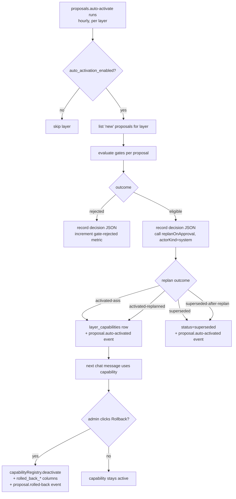

# Phase 8 — Self-learning, threshold-automated

> Parent: [`overall.md`](./overall.md) §8 Phase 8.
> Scope of this document: **detailed plan for phase 8 only**.
> Builds on phase 7
> ([`done/phase-07-self-learning.md`](./done/phase-07-self-learning.md)):
> the `improvement_proposals.threshold` column is already populated
> by the review agent (`apps/server/src/proposals/mint.ts`);
> the activation path (`apps/server/src/proposals/replan.ts`)
> already returns the four outcome labels
> (`activated-asis`, `activated-replanned`, `superseded`,
> `superseded-after-replan`) and emits the matching bus events;
> the per-layer registry
> (`apps/server/src/proposals/capability-registry.ts`) already
> activates + soft-deactivates capabilities with bus audit. Phase 8
> consumes those rails — it does **not** re-shape data, the chat
> pipeline, or the sandbox.

Phase 7 shipped the user-verified review loop end-to-end: per-layer
review agent mints proposals with a `threshold` field, a sandbox
produces side-by-side evidence, and admin approval triggers a
capability-snapshot re-plan before activation. The `threshold` field
is recorded but **never consulted** by the activation path — every
proposal still needs an explicit admin click today. Phase 8 closes
that gap: above-threshold proposals activate automatically,
**opt-in per layer** with a configurable cutoff and a cooldown,
while keeping the phase-7 manual flow as the default. Activation
always runs through the same `replanOnApproval(...)` code path
admins use, so the snapshot-diff guarantees and the four outcome
labels remain the single source of truth. A new manual **rollback**
affordance lets admins one-click deactivate any activated
capability and records the rollback in the proposal row.

The exit criterion from
[`overall.md` §8](./overall.md#phase-8--self-learning-threshold-automated)
— *"thresholded automation runs safely for a week with zero
rollbacks needed in dogfood use"* — forces three properties:
per-layer opt-in (small blast radius), a cooldown window (admins
can intercept before auto-activation), and sandbox-evidence gates
beyond the LLM-minted threshold (objective quality bars on top of
the model's self-rating).

---

## 1. Goal

Turn the `threshold` field that phase 7 quietly populated into the
activation signal it was always meant to be, **without** widening
the activation surface or weakening any phase 7 invariant. After
phase 8 a logged-in layer admin should be able to:

1. Open `/l/<slug>/settings/proposals` and configure:
   - `autoActivationEnabled` (bool, default `false`)
   - `thresholdCutoff` (0..1, default `1.0` = never)
   - `cooldownHours` (int, default `24`)
   - `requireThumbsUpDeltaPositive` (bool, default `true`)
   - `maxTokensDelta` (int, optional; default `null` = no cap)
2. Watch a new proposal mature past `cooldownHours`. When the
   hourly `proposals.auto-activate` job runs, an eligible proposal
   moves `new → activated` (via the same `replanOnApproval` path
   admins click). The proposal row carries
   `auto_activated_by = 'system'`, `auto_activated_at`, and a
   structured `auto_activation_decision_json` that names the gates
   it passed.
3. See the `auto-activated` badge on `/l/<slug>/proposals` and on
   the detail page; the decision JSON is rendered for transparency.
4. Click **Rollback** on an `activated` proposal. The capability is
   deactivated through the existing
   `capabilityRegistry.deactivate(...)` (no new soft-delete shape);
   the proposal row gains `rolled_back_at`, `rolled_back_by`,
   `rolled_back_reason`; the bus emits `proposal.rolled-back`.
5. Open `/admin/scheduled-tasks` and see one new row,
   `proposals.auto-activate`, with its run history.
6. Approve a proposal manually — phase 7's flow is unchanged; only
   the auto-path is additive.

---

## 2. Scope

In scope:

- **New table `layer_proposal_settings`** keyed by `layer_id`
  (1:1), holding the five toggles above + `updated_at`,
  `updated_by`. Migration `0017_proposals_phase8.sql`. Default
  rows are **lazy** — absent row = "auto-activation disabled,
  cutoff 1.0", matching phase 7's behavior exactly.
- **Audit-trail columns on `improvement_proposals`** (additive
  ALTERs in the same migration):
  - `auto_activated_by TEXT` (`'system'` literal when set by the
    auto-activate job; `NULL` otherwise — never a user id, since
    the human approve path keeps `approved_by`)
  - `auto_activated_at TEXT`
  - `auto_activation_decision_json TEXT` — every gate check, its
    threshold, and the boolean it returned, plus the
    `replanOnApproval` outcome label
  - `rolled_back_at TEXT`
  - `rolled_back_by TEXT REFERENCES users(id)`
  - `rolled_back_reason TEXT`
- **Pure gate function `evaluateAutoActivation(...)`** in
  `apps/server/src/proposals/auto-activate.ts`. Takes a proposal,
  its latest `improvement_proposal_artifacts` row, the layer's
  settings, and `now()`. Returns
  `{ outcome: 'eligible' } | { outcome: 'rejected', reason }`
  where `reason` is a closed-enum string:

  ```ts
  type Rejection =
    | 'auto-activation-disabled'
    | 'cooldown-not-elapsed'
    | 'threshold-below-cutoff'
    | 'sandbox-outcome-not-ok'
    | 'thumbs-up-delta-non-positive'
    | 'tokens-delta-over-cap'
    | 'no-sandbox-evidence';
  ```

  Pure code, no I/O. Trivially testable per reason.
- **New scheduled-task kind `proposals.auto-activate`** (default
  interval **1 h**). For every layer with
  `auto_activation_enabled = true`, lists `new` proposals via the
  existing repo, runs the gate, and on `eligible` calls
  `replanOnApproval(id, SYSTEM_ACTOR, deps)` — the same path the
  admin route uses. The `auto_activation_decision_json` is written
  before the call; `auto_activated_by = 'system'` +
  `auto_activated_at` are written on success regardless of the
  four-outcome label (`superseded` / `superseded-after-replan`
  count as decisions even though no capability is activated). One
  LLM call max per approval (only if the four-outcome path lands
  on `activated-replanned`); the gate itself is non-LLM.
  `flow_id = 'proposal.auto-activate:<runId>'`.
- **`SYSTEM_ACTOR` constant** — a fixed string actor (not a real
  `users.id`) used only by the auto-path. The proposal repo's
  approve path is extended with an `actorKind: 'user' | 'system'`
  argument: `'user'` writes `approved_by = users.id` (phase 7
  path); `'system'` writes `auto_activated_by = 'system'`. No new
  user row, no `users.id` foreign-key drift.
- **HTTP routes**:
  - `GET /l/:slug/settings/proposals` (read settings, falls back to
    defaults if no row)
  - `PUT /l/:slug/settings/proposals` (admin-only, zod-validated;
    writes a row if absent, updates if present; emits
    `layer.proposal-settings.updated` bus event for telemetry)
  - `POST /l/:slug/proposals/:id/rollback` (admin-only, body
    `{ reason: string (>= 5 chars) }`; calls the existing
    `capabilityRegistry.deactivate(...)`; on success writes
    `rolled_back_at` / `rolled_back_by` / `rolled_back_reason`;
    emits `proposal.rolled-back`)
- **Web UI**:
  - New page `/l/:slug/settings/proposals` — form with the five
    toggles, shadcn `<Form>` + zod resolver, save button,
    optimistic refetch. Empty / saving / error states all present.
  - `/l/:slug/proposals` list — new column **Source** showing
    `auto` / `manual` chip on activated rows; `auto-activated`
    badge on table.
  - `/l/:slug/proposals/:id` detail — when the proposal is
    auto-activated, render the `auto_activation_decision_json` as a
    collapsed "Why this was auto-activated" block (each gate +
    pass/fail). When the proposal is `activated`, render a
    **Rollback** button (admin-only) that opens a confirmation
    dialog with a required reason textarea. After rollback, render
    a "Rolled back on … by … because …" notice.
  - `ProposalsWidget` (phase 7) — no shape change; the new badge
    falls out from the same list payload.
- **Bus events** (additive; phase 7 events are untouched):
  - `proposal.auto-activated` — payload `{ proposalId, layerId,
artifactKind, outcome, threshold, decisionJson }`. Fired by the
    auto-activate job on every successful gate pass, even on
    `superseded` / `superseded-after-replan`.
  - `proposal.rolled-back` — payload `{ proposalId, layerId,
artifactKind, capabilityId, rolledBackBy, reason }`. Fired by the
    rollback route on success.
  - `layer.proposal-settings.updated` — payload `{ layerId,
updatedBy, changedFields: string[] }`. No sensitive values.
- **ADRs**:
  - [`0026 — Auto-activation gating contract`](../decisions/0026-auto-activation-gating.md).
    Records: the seven gates, why each one exists, why this layers
    on top of the LLM-minted threshold instead of replacing it,
    and why the auto-path calls `replanOnApproval` rather than a
    new activation primitive.
  - [`0027 — Manual rollback as soft-deactivate + audit`](../decisions/0027-manual-rollback.md).
    Records: rollback reuses `capability_registry.deactivate`,
    does not restore a previous version, and the rollback metadata
    lives on the proposal row (not a new audit table). Why no
    auto-rollback watcher (deferred follow-up).
- **Architecture docs**:
  - `architecture/self-learning.md` — new §6 "Threshold automation
    (phase 8)" with the gate flow and a Mermaid update extending
    phase 7's review-loop diagram.
  - `architecture/job-inventory.md` — one new row
    (`proposals.auto-activate`); `chat.review-layer` unchanged.
- **User guide** — extend
  `user/guides/improvement-proposals.md` with a new
  "Auto-activation (Phase 8)" section: what each setting does, when
  to turn it on, how rollback works.
- **Smoke** (`apps/server/tests/smoke.test.ts`): extend the phase-7
  loop. After approval activates a skill, simulate the auto-path
  end-to-end: a second proposal is minted, the layer's settings are
  enabled with `cutoff = 0.5` and `cooldown = 0`, the
  `proposals.auto-activate` job is run-now, the proposal goes
  `new → activated` via the auto-path, the decision JSON contains
  seven gate entries (all pass), and the rollback route then
  deactivates the capability. Worker-role smoke
  (`smoke-worker.test.ts`) pins that `proposals.auto-activate`
  registers under `--role=worker`.
- **i18n** — new keys under `proposals.autoActivation.*`,
  `proposals.rollback.*`, and `layer.settings.proposals.*` (en + nl
  1:1).
- **`tests/docs/job-inventory.test.ts`** updated with the new kind.

Out of scope (deferred, called out so a sub-phase cannot drag them
in):

- **Auto-rollback watcher.** Phase 8 ships manual rollback only. A
  scheduled `proposals.auto-rollback` watcher that deactivates
  capabilities whose post-activation thumbs ratio drops below a
  per-layer floor is a phase-9 follow-up; the audit-trail columns +
  bus events shipped here are the data foundation that follow-up
  would need.
- **Per-version capability rollback / restore.** Rollback is
  soft-deactivate; we do not re-activate a previous spec. There is
  no "previous version" of a capability today (each capability is
  one `layer_capabilities` row, one spec). Adding versioning to
  `layer_capabilities` is a separate effort.
- **Cross-layer proposal aggregation.** Still phase 8+ (called out
  in phase 7 §2 out-of-scope). Each gate evaluates one proposal
  scoped to one layer.
- **Stronger sandbox isolation (workers / containers).** Phase 7
  ADR 0024 fixed the in-process boundary; phase 8 does not extend
  it. The closed-enum handler-kind model is what keeps auto-path
  activations defensible.
- **Threshold auto-tuning.** Cutoffs are admin-set; we do not
  observe outcomes and adjust them. Telemetry surfaces the
  distribution so admins can tune manually.
- **Tool-calling answerer.** Still owned by
  `chat-tool-calling-answerer.md`; phase 8 does not alter the
  answerer step.

---

## 3. Sub-phases

| #   | Title                                                                                                                                                                                                                                                                                                                                                                                                                                | Estimate | Output                                                                                              |
| --- | ------------------------------------------------------------------------------------------------------------------------------------------------------------------------------------------------------------------------------------------------------------------------------------------------------------------------------------------------------------------------------------------------------------------------------------- | -------: | --------------------------------------------------------------------------------------------------- |
| 8.0 | This detail plan + ADR stubs (`0026`, `0027` as `proposed`) + six tasklist rows for 8.1–8.6                                                                                                                                                                                                                                                                                                                                          |       3h | plan + ADR drafts; tasklist rows 8.1–8.6 `open`                                                     |
| 8.1 | Migration `0017_proposals_phase8.sql` (new `layer_proposal_settings` table + audit-trail ALTERs on `improvement_proposals`) + repo (`layer-proposal-settings-repo.ts`) + zod schemas in `packages/shared/src/proposals.ts` (extends, not replaces) + unit tests on the new repo + migration round-trip                                                                                                                                |       5h | schema applied; existing proposals tests still green; new settings row CRUD round-trips             |
| 8.2 | Pure gate function `evaluateAutoActivation(...)` + closed-enum rejection reasons + a fixture-driven unit test per rejection reason + an "all gates pass" eligible test. No bus, no DB, no I/O — pure code                                                                                                                                                                                                                            |       4h | gate decision table is deterministic and locked in by tests                                         |
| 8.3 | New scheduled task `proposals.auto-activate` (1 h interval, `--role=worker`, registered via the existing `register…Handler` pattern; appears in `job-inventory.md`); body iterates enabled layers, runs the gate, calls `replanOnApproval(id, SYSTEM_ACTOR, deps)`; writes `auto_activation_decision_json` before the call; emits `proposal.auto-activated`; the proposal repo's approve path accepts `actorKind: 'user' \| 'system'` |       8h | end-to-end auto-path works against the mock LLM; integration test covers all four replan outcomes  |
| 8.4 | HTTP routes (`GET/PUT /l/:slug/settings/proposals`, admin-only PUT) + web UI page `/l/:slug/settings/proposals` (form + states + i18n) + list / detail badges for `auto-activated` proposals + decision JSON renderer on the detail page                                                                                                                                                                                            |       6h | admins can read + write per-layer settings; auto-activated proposals visibly distinguishable        |
| 8.5 | Manual rollback: `POST /l/:slug/proposals/:id/rollback` (admin-only, reason required) + UI button + confirmation dialog + rollback notice on the detail page + bus event `proposal.rolled-back`; capability deactivation goes through the existing `capabilityRegistry.deactivate(...)`                                                                                                                                              |       4h | admin can rollback any `activated` proposal in two clicks; audit trail on the row                   |
| 8.6 | Smoke (`apps/server/tests/smoke.test.ts` + `smoke-worker.test.ts`) + en/nl i18n + ADRs 0026/0027 accepted + `architecture/self-learning.md` §6 + `architecture/job-inventory.md` row + `user/guides/improvement-proposals.md` extension + close-out (move plan to `done/`, write `overall.md` §8 phase-8 status block)                                                                                                                 |       5h | green CI; plan moves to `done/`; overall.md §8 phase-8 status block written                         |

Each sub-phase needs its own `open → done` row in
`docs/dev/tasklist.md` referencing this plan. 8.0 closes when this
file + the two ADR stubs + the six new tasklist rows land in one
commit.

---

## 4. Approach

### 4.1 Settings table + audit columns (lands in 8.1)

```sql
-- 0017_proposals_phase8.sql sketch

CREATE TABLE layer_proposal_settings (
  layer_id TEXT PRIMARY KEY REFERENCES layers(id),
  auto_activation_enabled INTEGER NOT NULL DEFAULT 0,
  threshold_cutoff REAL NOT NULL DEFAULT 1.0
    CHECK (threshold_cutoff >= 0 AND threshold_cutoff <= 1),
  cooldown_hours INTEGER NOT NULL DEFAULT 24
    CHECK (cooldown_hours >= 0 AND cooldown_hours <= 720),
  require_thumbs_up_delta_positive INTEGER NOT NULL DEFAULT 1,
  max_tokens_delta INTEGER,  -- nullable = no cap
  updated_at TEXT NOT NULL,
  updated_by TEXT NOT NULL REFERENCES users(id)
);

ALTER TABLE improvement_proposals
  ADD COLUMN auto_activated_by TEXT;          -- 'system' literal
ALTER TABLE improvement_proposals
  ADD COLUMN auto_activated_at TEXT;
ALTER TABLE improvement_proposals
  ADD COLUMN auto_activation_decision_json TEXT;
ALTER TABLE improvement_proposals
  ADD COLUMN rolled_back_at TEXT;
ALTER TABLE improvement_proposals
  ADD COLUMN rolled_back_by TEXT REFERENCES users(id);
ALTER TABLE improvement_proposals
  ADD COLUMN rolled_back_reason TEXT;
```

- Absent settings row = "auto-activation disabled, defaults as
  above". Repo's `get(layerId)` returns the default object when
  the row is absent — no NULL pollution upstream.
- No new index on `improvement_proposals` is needed; the auto-path
  reuses the existing `idx_improvement_proposals_layer_status`
  index for the `WHERE layer_id = ? AND status = 'new'` query.

### 4.2 Pure gate function (lands in 8.2)

```ts
// apps/server/src/proposals/auto-activate.ts — pseudo-shape

export type AutoActivationDecision =
  | { outcome: 'eligible'; gates: GateRecord[] }
  | { outcome: 'rejected'; reason: Rejection; gates: GateRecord[] };

interface GateRecord {
  name: string;
  passed: boolean;
  detail: Record<string, unknown>;
}

export function evaluateAutoActivation(input: {
  proposal: ImprovementProposalRow;
  proposedArtifact: ImprovementProposalArtifactRow | null;
  settings: LayerProposalSettings;  // resolved (no NULLs)
  now: Date;
}): AutoActivationDecision {
  // 1. auto-activation enabled
  // 2. cooldown elapsed (now - proposal.minted_at >= cooldownHours)
  // 3. threshold >= cutoff
  // 4. proposedArtifact exists
  // 5. sandboxOutcome === 'ok'
  // 6. !requireThumbsUpDeltaPositive || thumbsUpDelta > 0
  // 7. maxTokensDelta == null || tokensDelta <= maxTokensDelta
  // First failing gate short-circuits with its reason; all-pass
  // returns eligible.
}
```

- The gate order is **deliberate** — cheapest checks first
  (`auto-activation-disabled`, `cooldown-not-elapsed`) so the
  hourly job doesn't read the artifact row for ineligible
  proposals.
- Every gate appends a `GateRecord`. On `eligible` the full record
  list is serialized into `auto_activation_decision_json`. On
  `rejected` the record list ends at the failing gate, plus a
  final synthetic entry naming the rejection reason — the same
  JSON shape feeds telemetry
  (`proposal.auto-activation.gate-rejected` dimensioned by
  `reason`).
- The function is pure: no clock, no I/O. `now` is injected so
  cooldown tests are deterministic.

### 4.3 Scheduled task wiring (lands in 8.3)

```ts
// apps/server/src/proposals/scheduled.ts — sketch

async function runAutoActivate(ctx: HandlerContext) {
  for (const layer of layersRepo.listAllNonDeleted()) {
    const settings = settingsRepo.get(layer.id); // resolved defaults
    if (!settings.autoActivationEnabled) continue;

    const candidates = proposalsRepo.listByLayerAndStatus(layer.id, 'new');
    for (const proposal of candidates) {
      const artifact = artifactsRepo.latestProposed(proposal.id);
      const decision = evaluateAutoActivation({
        proposal,
        proposedArtifact: artifact,
        settings,
        now: ctx.now(),
      });

      proposalsRepo.recordAutoActivationDecision(proposal.id, decision);
      ctx.metrics.increment('proposal.auto-activation.gate-rejected_count', {
        reason: decision.outcome === 'rejected' ? decision.reason : 'none',
      });

      if (decision.outcome !== 'eligible') continue;

      const result = await replanOnApproval(proposal.id, SYSTEM_ACTOR, {
        ...deps,
        actorKind: 'system',
      });
      proposalsRepo.recordAutoActivation(proposal.id, ctx.now());
      bus.publish({
        type: 'proposal.auto-activated',
        payload: {
          proposalId: proposal.id,
          layerId: layer.id,
          artifactKind: proposal.artifactKind,
          outcome: result.outcome,
          threshold: proposal.threshold,
        },
      });
    }
  }
}
```

- **`actorKind` plumbed through the proposal repo's approve API.**
  Phase 7's `approve(...)` writes `approved_by = userId` and
  `approved_at`; phase 8 adds an overload (or a discriminator
  arg): `'user'` keeps phase 7's behavior, `'system'` writes
  `auto_activated_by = 'system'` and `auto_activated_at` instead.
  Both paths set `status = 'activated'` via the same `replan.ts`
  outcome handler. No phase-7 callsites change.
- `replanOnApproval` already handles all four outcome labels —
  `superseded` and `superseded-after-replan` still count as
  "the system made a decision" for the audit trail. The decision
  JSON records the four-outcome label; the `auto_activated_*`
  columns are set regardless so the row visibly shows
  "auto-touched".
- The job's `defaultSchedule` is `interval, 60 minutes`. The
  cooldown is enforced *by the gate*, not by the job interval —
  the job runs every hour, but a proposal only becomes `eligible`
  after its minted_at + cooldown_hours has elapsed.
- One LLM call per `activated-replanned` outcome (existing phase 7
  cost). The gate itself never calls the LLM.
- `flow_id = 'proposal.auto-activate:<runId>'` on the LLM call,
  so re-plan calls from the auto-path are filterable in
  `/admin/llm/logs`.

### 4.4 Settings HTTP + UI (lands in 8.4)

```txt
+---------------------------------------------------------------------+
| Layer settings — Proposals                                          |
|---------------------------------------------------------------------|
| Auto-activation                                                     |
|   [ ] Enable auto-activation for this layer                         |
|                                                                     |
| Threshold cutoff                  [______]   (0.00 – 1.00, def 1.00)|
|   Proposals with threshold >= this value can auto-activate.         |
|                                                                     |
| Cooldown                          [______] hours  (default 24)      |
|   Wait this long after a proposal is minted before auto-activating. |
|                                                                     |
| Sandbox quality bars                                                |
|   [x] Require thumbs-up delta > 0                                   |
|   [ ] Cap tokens delta at      [______]                             |
|                                                                     |
|                                  [Cancel]            [Save changes] |
+---------------------------------------------------------------------+
```

- shadcn `<Form>` with zod resolver mirroring the server zod
  schema (one source of truth in
  `packages/shared/src/proposals.ts`).
- States: idle / saving / saved (toast) / error / read-only (when
  the viewer is not a layer admin — values shown, form disabled).
- The page is reachable from the existing layer-settings shell;
  if that shell doesn't expose a "Proposals" tab today, the 8.4
  task adds one tab entry (small, contained change).
- The `/l/:slug/proposals` list gains a **Source** column (`auto`
  / `manual` chip on `activated` rows). The detail page renders a
  collapsed "Auto-activation decision" panel — one row per gate
  with a green / red icon, the threshold, and the observed value.

### 4.5 Manual rollback (lands in 8.5)

```ts
// apps/server/src/http/routes/layer-proposals.ts — new handler

router.post('/l/:slug/proposals/:id/rollback', requireAdmin, async (req) => {
  const { reason } = RollbackBodySchema.parse(req.body); // reason >= 5 chars
  const proposal = proposalsRepo.get(req.params.id);
  if (proposal.status !== 'activated') return 409;
  const capability = capabilityRegistry.findActiveByOrigin(`proposal:${proposal.id}`);
  if (!capability) return 409;
  capabilityRegistry.deactivate({ id: capability.id, deactivatedBy: req.user.id });
  proposalsRepo.recordRollback(proposal.id, {
    rolledBackBy: req.user.id,
    reason,
    now: nowIso(),
  });
  bus.publish({ type: 'proposal.rolled-back', payload: { /* … */ } });
  return 200;
});
```

- Rollback **only** soft-deactivates the linked capability
  (`origin = 'proposal:<id>'`); we deliberately do not touch
  other capabilities even if they share a name (none should — the
  origin string is unique per proposal).
- The reason is rendered on the detail page as "Rolled back on
  <date> by <user> because <reason>" — gives the audit trail a
  human face. Reason is not logged to telemetry (free-form text
  → high cardinality / sensitive).
- Rollback is allowed regardless of whether the proposal was auto-
  or manually activated — admins shouldn't have to remember which
  path activated a bad capability.

### 4.6 Telemetry, logging, analytics

- **Console + file logging**: auto-activate job logs
  `event: 'proposal.auto-activate.run'` (counters per layer) +
  `event: 'proposal.auto-activate.eligible'` / `'…rejected'`
  per proposal. Rollback logs
  `event: 'proposal.rolled-back'` with proposal id + layer id +
  capability id (no reason in the log — see above).
- **Telemetry**:
  - `proposal.auto-activate.run.duration_ms` (dimensioned by
    `runOutcome: 'ok' | 'error'`)
  - `proposal.auto-activate.decided_count` (dimensioned by
    `decision: 'eligible' | 'rejected'` and `rejectionReason`
    closed enum)
  - `proposal.auto-activated_count` (dimensioned by `outcome`
    closed enum — the four `replanOnApproval` labels)
  - `proposal.rolled-back_count` (dimensioned by `artifact_kind`
    closed enum)
  - **Cardinality**: never use `proposalId` or `layerId` as a
    telemetry dimension. The closed-enum dimensions stay bounded.
- **Analytics** (uses the placeholder primitive from
  `web-analytics-primitive.md`): `proposal_settings_opened`,
  `proposal_settings_saved`, `proposal_rolled_back` (no reason
  text). Existing phase 7 events are unchanged.
- LLM calls inherit phase 1 logging; new `flow_id` value
  `proposal.auto-activate:<runId>` for filtering in
  `/admin/llm/logs`.

---

## 5. Affected modules

- **New**:
  - `apps/server/src/proposals/auto-activate.ts` (pure gate +
    decision types)
  - `apps/server/src/proposals/scheduled/auto-activate-handler.ts`
    (the new scheduled-task body)
  - `apps/server/src/proposals/repos/layer-proposal-settings-repo.ts`
  - `apps/server/src/http/routes/layer-proposal-settings.ts`
  - `apps/web/src/pages/LayerProposalsSettingsPage.tsx`
- **Migrated / extended**:
  - `apps/server/src/storage/migrations/0017_proposals_phase8.sql`
    (new)
  - `apps/server/src/proposals/repos/improvement-proposals-repo.ts`
    (new methods `recordAutoActivationDecision`,
    `recordAutoActivation`, `recordRollback`; existing `approve`
    gains `actorKind: 'user' | 'system'`)
  - `apps/server/src/proposals/replan.ts` (small: thread
    `actorKind` through so it sets `approved_by` only when
    `'user'`; otherwise leaves it `NULL` and the
    `auto_activated_*` columns get set by the caller)
  - `apps/server/src/proposals/scheduled.ts` (registers the new
    handler)
  - `apps/server/src/http/routes/layer-proposals.ts` (adds
    `POST /l/:slug/proposals/:id/rollback`)
  - `apps/server/src/index.ts` (wires the settings + auto-activate
    handler registrations; no other change)
  - `apps/web/src/App.tsx` (one new route)
  - `apps/web/src/pages/LayerProposalsListPage.tsx` (Source chip)
  - `apps/web/src/pages/LayerProposalDetailPage.tsx` (decision
    panel + Rollback button + rollback notice)
  - `apps/web/src/i18n/locales/{en,nl}.json` (new keys)
  - `apps/web/src/lib/api.ts` (settings + rollback functions)
  - `packages/shared/src/proposals.ts` (zod for settings + new
    decision JSON shape)
- **Reused unchanged**: `replanOnApproval` (phase 7),
  `capabilityRegistry.activate / deactivate` (phase 7),
  `LayerResolver`, `requireLayer` / `requireAdmin` middleware,
  the durable bus, the scheduled-task registry, `llm_calls`
  telemetry, the chat pipeline, the sandbox runner.

---

## 6. Tests

- **Unit**:
  - `evaluateAutoActivation`: one fixture per `Rejection` reason
    asserting that the right reason is returned and the GateRecord
    list ends at the failing gate; one fixture for `eligible` with
    all seven gates passing.
  - `layer-proposal-settings-repo`: CRUD round-trip; default
    object returned when row absent; zod validation rejects
    out-of-range cutoff / negative cooldown / negative tokens
    cap.
  - `improvement-proposals-repo.approve(actorKind: 'system')`:
    writes `auto_activated_by = 'system'`, leaves `approved_by`
    NULL.
  - `recordAutoActivationDecision` round-trips a JSON gate list.
- **Integration**:
  - Auto-path end-to-end against `MockLlmClient`: seed a proposal,
    enable settings, run the job, assert the proposal moves to
    `activated` and the capability is registered. Repeat for the
    other three `replanOnApproval` outcome labels by manipulating
    the capability snapshot.
  - Gate-rejection path: every `Rejection` reason has a test that
    seeds the matching condition and asserts the job leaves
    `status = 'new'`, records the decision JSON, increments the
    `gate-rejected` metric, and emits no `proposal.auto-activated`
    event.
  - Cooldown: a proposal minted `cooldownHours - 1` ago stays
    `new`; the same proposal at `cooldownHours + 1` activates.
- **HTTP**:
  - `PUT /l/:slug/settings/proposals` admin-only (non-admin →
    403); validation errors for out-of-range values; idempotent
    on repeat saves.
  - `POST /l/:slug/proposals/:id/rollback` admin-only; rejects on
    non-`activated` proposals (409); rejects without a reason
    (400); on success: capability deactivated, proposal row has
    `rolled_back_*` fields, bus event emitted.
- **Auth boundary**: auto-activate job processes only the layer it
  iterates (no cross-layer leak); rollback can only target a
  capability whose `layer_id` matches the request path.
- **Job inventory**:
  `tests/docs/job-inventory.test.ts` catches a missing
  `proposals.auto-activate` row.
- **i18n**: existing `tests/docs/i18n.test.ts` catches missing nl
  keys.
- **Smoke** (`smoke.test.ts` + `smoke-worker.test.ts`): the end-
  to-end run described in §2 above.

---

## 7. Docs impact

- **New**: ADR 0026 (auto-activation gating contract); ADR 0027
  (manual rollback contract).
- **Updated**:
  - `architecture/self-learning.md` — new §6 "Threshold
    automation (phase 8)" with gate flow + extended Mermaid.
  - `architecture/job-inventory.md` — one new row.
  - `architecture/overview.md` — auto-activate module added.
  - `user/guides/improvement-proposals.md` — new section on
    auto-activation + rollback.
  - `plans/overall.md` §8 — phase 8 status block written at
    close-out (mirror phase 6 / 7 blocks).

---

## 8. i18n impact

New namespaces (en primary, nl 1:1; CI catches drift):

- `proposals.autoActivation.{badge, decisionTitle, decisionGateName.*,
decisionGatePassed, decisionGateFailed, decisionGateThreshold,
decisionGateObserved}`
- `proposals.source.{auto, manual}`
- `proposals.rollback.{cta, dialogTitle, dialogDescription,
reasonLabel, reasonPlaceholder, reasonRequired, confirmCta,
cancelCta, noticeFormat, errorAlreadyDeactivated,
errorNotActivated}`
- `layer.settings.proposals.{title, pageDescription,
enabledLabel, enabledDescription, thresholdCutoffLabel,
thresholdCutoffDescription, cooldownHoursLabel,
cooldownHoursDescription, requireThumbsUpDeltaLabel,
maxTokensDeltaLabel, maxTokensDeltaCapLabel, saveCta,
savedToast, errorOutOfRange, errorNetwork}`
- `nav.layerSettings.proposals`

---

## 9. Accessibility impact

- Settings form: real `<label>` for every input;
  `<input type="number">` for numeric values with `min` / `max`
  attributes; one inline error per field, announced via
  `aria-live="polite"`.
- Rollback confirmation: uses the existing dialog primitive (focus
  trap, `Escape` closes, focus returns to the trigger).
- Source chip on the list: visible text (not icon-only); `title`
  attribute for hover; `aria-label` for screen readers.
- Decision panel on the detail page: `<details><summary>` for the
  collapsed default, semantic `<table>` for the gate list, `<th>`
  for column headers, `aria-sort` not needed (no sort).

---

## 10. Security impact

- **Closed-enum handler kinds (phase 7 ADR 0024) still gate the
  auto-path.** The auto-path activates *the same `ProposalSpec`*
  the sandbox validated; no new code interpretation. The gate
  function is pure and does not interpret spec fields beyond the
  metrics already in `metrics_json`.
- **`SYSTEM_ACTOR` is never a real user.** It's a fixed literal
  string written to `auto_activated_by`. The user FKs
  (`approved_by`, `rolled_back_by`) remain valid; no fake user
  row, no auth claim is created.
- **Settings writes are admin-only** via the existing
  `requireAdmin` (mirrors phase 7's
  `POST /l/:slug/proposals/:id/approve` gate). Non-admin GET
  returns 200 (settings are readable in-layer, like proposals).
- **Rollback is admin-only**; the existing
  `capabilityRegistry.deactivate(...)` already enforces the
  layer scope; the new repo helper double-checks the
  `(proposal_id → layer_id) == request.layer_id` invariant.
- **Rollback reason is never logged or sent to analytics** —
  free-form user text. It is stored on the proposal row (admin
  audit only).
- **Telemetry dimensions are closed-enum**: rejection reasons,
  outcome labels, artifact kind. Proposal id and layer id are
  never label values.
- **Auto-activate does not bypass the snapshot diff** — it goes
  through `replanOnApproval`. A drift-superseded proposal becomes
  `superseded` instead of activating. The audit columns record
  the decision either way.

---

## 11. Risks

| Risk                                                                                                                                            | Likelihood | Impact | Mitigation                                                                                                                                                                                                                                                                                                                |
| ----------------------------------------------------------------------------------------------------------------------------------------------- | ---------- | -----: | ------------------------------------------------------------------------------------------------------------------------------------------------------------------------------------------------------------------------------------------------------------------------------------------------------------------------- |
| Auto-activated proposal silently degrades chat quality                                                                                          | Med        |   High | Opt-in per layer (default off); seven-gate evaluation including `sandboxOutcome === 'ok'` + `thumbsUpDelta > 0`; cooldown window so admins can intercept; manual rollback ships in 8.5; phase-9 follow-up `proposals-auto-rollback-watcher.md` carries the future regression detector.                                       |
| Threshold cutoff misconfiguration auto-activates everything                                                                                     | Med        |    Med | `threshold_cutoff` defaults to 1.0 (never); zod + DB CHECK constraints clamp to [0, 1]; UI surfaces "how many `new` proposals would currently be eligible at this cutoff?" preview (cheap server-side count).                                                                                                                  |
| The auto-path's `actorKind: 'system'` change to the proposal-approve API breaks phase-7 callsites                                              | Low        |    Med | Default `actorKind = 'user'` to keep phase 7 callsites untouched; one type-check test pins the union; integration test confirms `approved_by` is still written for the human path.                                                                                                                                              |
| Cooldown bypassed by clock skew between mint and auto-activate runs                                                                             | Low        |    Low | Both use `ctx.now()` from the same scheduled-task harness; the gate compares ISO timestamps; a unit test pins boundary behavior (`cooldown - 1 ms` rejected, `cooldown + 1 ms` accepted).                                                                                                                                       |
| Decision JSON grows unbounded                                                                                                                   | Low        |    Low | Seven gates, ~200 bytes each ≈ 1.5 KB max per proposal; a single TEXT column is sufficient. No retention surprise.                                                                                                                                                                                                              |
| Race: admin rejects a proposal while auto-activate is mid-flight                                                                                | Low        |    Med | The proposal repo's status transitions are guarded by a `WHERE status = 'new'` predicate; whichever path commits first wins; the loser sees a 409 and logs `event: 'proposal.auto-activate.race-lost'`. Telemetry counter `proposal.auto-activate.race-lost_count` makes it observable.                                          |
| Auto-activate run loop time grows with layer count                                                                                              | Low        |    Low | The job processes only layers with `auto_activation_enabled = true`; the candidate query is index-backed (`idx_improvement_proposals_layer_status`); `proposal.auto-activate.run.duration_ms` telemetry surfaces drift.                                                                                                          |
| Rollback orphans a proposal that has no live capability (e.g. it was deactivated by admin elsewhere)                                            | Med        |    Low | Route returns 409 `errorAlreadyDeactivated` when no active capability is found; the proposal row is **not** updated (admins keep a clean audit; the prior deactivation already recorded by the registry).                                                                                                                       |
| Users expect threshold to "do something" on layers where auto-activation is disabled (phase 7's risk row, carried forward)                      | Med        |    Low | Phase 7 already labels the field; phase 8 ships the settings page where the explanation lives; the user guide spells it out. Telemetry on threshold distribution stays so admins have data when tuning.                                                                                                                          |

No new entries planned for `docs/dev/risks/`. The rows above do
not promote to first-class risk docs unless `bun run docs:check`
flags one during the phase.

---

## 12. Open questions (answered before 8.3 starts; do not block 8.0–8.2)

1. **System actor representation in `approved_by`**: leave NULL +
   set `auto_activated_*` (chosen — see §2), or seed a `system`
   user row at install time? Leaving NULL avoids a fake user row,
   keeps `users.id` semantically "human-identified", and the
   `auto_activated_*` columns carry the audit. Decision pinned in
   ADR 0026.
2. **Cooldown unit**: hours (current plan), days, or arbitrary
   minutes? Hours strikes the right balance for a layer admin
   tuning weekly behavior; minutes feels operational, days too
   coarse. CHECK constraint `0..720` (≈ 30 days) caps abuse.
3. **What happens to in-flight `new` proposals when settings are
   saved with `auto_activation_enabled = false`?** Nothing — they
   stay `new`. The setting only affects future job runs; in-flight
   proposals never auto-activate. The next job run skips the layer
   entirely. The user guide notes this.

---

## 13. Verification

End-to-end manual smoke (mirrors phase 7 §13 shape; runs at 8.6
close-out):

1. `bun install && bun run dev` → log in as admin, switch to a
   layer with a calendar event titled "Acme strategy".
2. Open `/l/<slug>/settings/proposals`. Settings page shows the
   defaults (off). Enable auto-activation, set `cutoff = 0.5`,
   `cooldown = 0`, leave thumbs-up-delta-positive checked. Save.
3. Trigger `chat.review-layer` from `/admin/scheduled-tasks`
   (phase-7 path). One proposal lands in `new`.
4. Trigger `proposals.auto-activate` from
   `/admin/scheduled-tasks` (run-now). The job runs in seconds.
5. `/l/<slug>/proposals` — proposal is now `activated`, **Source**
   column shows `auto`. Click into the detail page; the
   "Auto-activation decision" panel shows seven green gates with
   the observed values.
6. `/l/<slug>/capabilities` — the new capability is listed; origin
   is `proposal:<uuid>`.
7. Ask the same question in `/l/<slug>/chat`. The answer references
   the calendar event (phase-7 invariant unchanged).
8. Back on the detail page: click **Rollback**, type a reason,
   confirm. The page shows the rollback notice.
   `/l/<slug>/capabilities` no longer lists the capability (it's
   deactivated).
9. Ask the question one more time — the answer reverts to phase-7
   pre-skill behavior (skill no longer active).
10. SQLite: `improvement_proposals` row has `auto_activated_at`,
    `auto_activated_by = 'system'`,
    `auto_activation_decision_json` populated, `rolled_back_at` +
    `rolled_back_by` + `rolled_back_reason` populated.
11. `/admin/llm/logs` shows the auto-path re-plan (if any) with
    `flow_id=proposal.auto-activate:<runId>`.
12. CI: `bun run format:check && bun run lint && bun run typecheck
&& bun test && bun run build && bun run docs:check && bun run
i18n:check` all green.
13. Smoke (`bun test apps/server/tests/smoke.test.ts`) and
    `smoke-worker` both green.

---

## 14. Close-out checklist (from `AGENTS.md`)

When phase 8 closes:

- All 7 tasklist rows for phase 8 are `done`.
- This plan moves from
  `docs/dev/plans/phase-08-threshold-automation.md` →
  `docs/dev/plans/done/phase-08-threshold-automation.md`; tasklist
  `Related document` paths updated.
- `docs/dev/plans/overall.md` §8 phase-8 status block written
  (mirror the phase-7 block).
- Two new ADRs accepted (0026 / 0027).
- `docs/dev/architecture/job-inventory.md` lists
  `proposals.auto-activate`; `tests/docs/job-inventory.test.ts`
  green.
- No new entries in `docs/dev/risks/` beyond §11 unless promoted.
- One follow-up filed: `proposals-auto-rollback-watcher.md`
  (carries the auto-rollback regression detector deferred from
  §2 out-of-scope), referenced from the phase-8 overall-status
  block.

---

## 15. Mermaid — threshold automation


