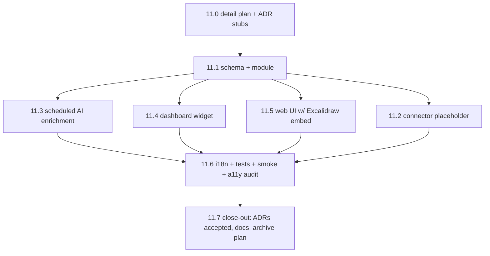
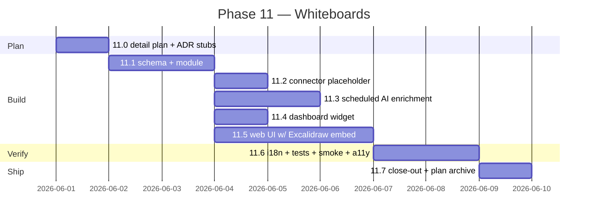

# Phase 11 — Whiteboards (Excalidraw OSS)

> Parent: [`overall.md`](./overall.md) §6 catalogue + §8 "Later" +
> §10 decision 5 ("Excalidraw + Kanban → use existing OSS").
> Scope of this document: **detailed plan for phase 11 only**.
> Inherits from `overall.md` §4 (stack), §5 (event-sourced core,
> soft-delete, versioned entities, layered scoping, auth-aware
> retrieval, multi-language, AI-augmented CRUD), §7 (cross-cutting
> concerns), §10.5 (use existing OSS components).
> Builds on phase 4 ([`done/phase-04-first-entities.md`](./done/phase-04-first-entities.md))
> — the universal `EntityModule` / `EntityStore` / generic router
> contract is the substrate. Whiteboards register a module; the
> router, translator, soft-delete, version chain, soul slice, and
> connector base are all inherited as-is.

---

## 1. Goal

Add **Whiteboards** as the next §6 entity kind on top of the
existing entity contract, using **upstream Excalidraw OSS**
(`@excalidraw/excalidraw`) for the canvas. After phase 11 a user
in a layer can:

1. Open `/l/<slug>/whiteboards`, see the list of whiteboards
   visible in the layer (with thumbnails), create a new one.
2. Open a whiteboard, draw / annotate / drag elements inside an
   embedded Excalidraw canvas. Saves are debounced and produce
   a new version on checkpoint, not per keystroke.
3. Export the current scene as PNG or SVG via Excalidraw's own
   export API.
4. See the layer dashboard's `WhiteboardsWidget` listing the most
   recently updated whiteboards with thumbnails.
5. Ask the phase-6 chat agent "wat staat er op het whiteboard
   over X" and get an authorised, layer-scoped answer driven by
   the scene-text index written into LanceDB.

The phase **does not** fork or extend Excalidraw. The wrapper
remains a thin React component that owns persistence + auth +
i18n + telemetry. Drawing primitives, undo, multi-select, and
keyboard behaviour come from Excalidraw upstream.

---

## 2. Scope

In scope:

- §11.1 schema + `whiteboardModule` (per-kind table, zod payload,
  registration, mounted via the generic router).
- §11.2 connector placeholder — no external system in v1; the
  registry slot exists so a future Miro / FigJam / tldraw-import
  connector lands additively via the §4.0 connector base.
- §11.3 AI enrichment — scheduled scene summariser +
  entity-mention extractor (`@AMI BV` style mentions inside text
  elements link to a `company`/`contact`/`todo` in the layer via
  the resolver from phase 6).
- §11.4 `WhiteboardsWidget` (recent whiteboards + thumbnail) in
  the layer dashboard.
- §11.5 web UI `/l/:slug/whiteboards` — list + detail view with
  embedded Excalidraw canvas; debounced save (`Y` ms idle →
  checkpoint), explicit "Save version" button, and PNG / SVG
  export via Excalidraw's `exportToBlob` / `exportToSvg`.
- §11.6 i18n + tests + smoke (including smoke-worker enrichment
  pass).
- §11.7 close-out — ADRs accepted, architecture doc, job-inventory
  rows, user guide extension.

Out of scope (deferred — explicit follow-ups when needed):

- **Real-time multi-user collaboration.** Excalidraw's collab
  module needs a websocket relay + room model + presence + CRDT
  conflict handling. Single-writer-at-a-time only in v1; the UI
  shows a "locked by <user>" notice when another session is
  editing the same whiteboard.
- **Embedded library / shape libraries beyond the upstream
  defaults.** No bundled `.excalidrawlib` packs in v1.
- **Image elements with arbitrary upload size.** Image fileIds
  are stored in the scene's `files` map; v1 enforces a per-file
  size cap (see §8 Risks).
- **Per-field translation of scene text.** Per-record
  `originalLocale` only, consistent with §10.7 — a scheduled
  translator emits a translated payload (text elements
  re-translated) and stores it in `entity_translations`. The
  original scene stays the source of truth.
- **Excalidraw fork or custom build.** Upstream OSS only
  (`overall.md` §10.5). Any feature gap becomes either a wrapper
  affordance outside the canvas or a deferred follow-up.

---

## 3. Non-Goals (phase 11)

- No collaborative editing.
- No bespoke drawing canvas. If Excalidraw cannot do it, it does
  not ship in v1.
- No per-element version chain — checkpoints are scene-level
  snapshots, not element diffs.
- No real-time push from external systems.
- No PDF export — PNG + SVG only via the upstream API.
- No "agent draws on the whiteboard" capability — enrichment
  reads, never mutates the scene.

---

## 4. Approach

### 4.1 Sub-phases (delivery order — one tasklist row each)

#### 11.0 — Detail plan + ADR stubs _(prerequisite for 11.1..11.7)_

Goal: land this plan + three ADR stubs (`proposed`):

- ADR `0028 — whiteboard contract` — scene stored as opaque
  validated JSON inside `payload_json`; version chain via
  **snapshot-on-checkpoint** (not per-keystroke); `searchable_text`
  derived from text-element extraction at save time.
- ADR `0029 — excalidraw embedding policy` — upstream OSS only,
  no fork, no extensions; wrapper owns persistence + auth + i18n;
  feature gaps become deferred follow-ups.
- ADR `0030 — whiteboard asset storage` — Excalidraw `files` map
  persisted alongside `payload_json` under the same row; per-file
  size cap; binary kept in JSON until a phase-15 file-storage
  entity provides a real BLOB sink.

Concrete ADR numbers were assigned at write-time of these stubs
(2026-05-25): `0028`/`0029`/`0030`. If phases 9 or 10 land ADRs
before phase 11 starts implementation, the stubs are renumbered
in the same commit that opens 11.1.

Tasklist row updates only; no migration, no code.

#### 11.1 — Schema + module _(per §4 cadence)_

| Sub-step | What ships                                                                                                                                                                                                                                                                                                                                                                                                                                                                                                                                                                                                                                                                                  |
| -------- | ----------------------------------------------------------------------------------------------------------------------------------------------------------------------------------------------------------------------------------------------------------------------------------------------------------------------------------------------------------------------------------------------------------------------------------------------------------------------------------------------------------------------------------------------------------------------------------------------------------------------------------------------------------------------------------------- |
| Schema   | Migration `00NN_whiteboards.sql` (next free slot — `0020_proposals_auto_rollback.sql` is the current head, so this is `0021_whiteboards.sql` unless phases 9/10 land first). Per-kind table follows the §4 shape: `id`, `layer_id`, `slug`, `title`, `searchable_text`, `original_locale`, `payload_json`, `created_at/by`, `updated_at/by`, `deleted_at/by`, `version`. Whiteboard-specific indexed columns: `last_checkpoint_at TEXT`, `thumbnail_blob BLOB NULL`, `thumbnail_etag TEXT NULL`, `scene_byte_size INTEGER NOT NULL DEFAULT 0`. Indexes on `(layer_id)`, `(layer_id, updated_at DESC)` for list ordering, `(deleted_at)` for soft-delete sweep. No JSON column other than payload. |
| Module   | `apps/server/src/entities/whiteboards/`: `module.ts` (zod payload — `{ scene: ExcalidrawSceneSchema, files: Record<string, ExcalidrawFileEntry> }`), `index.ts` calling `registerEntityModule(module)`, `enrichment.ts` (stub — registers the per-kind enrichment job kind), `stats.ts` (optional `summaryColumns` extension for the list view: last-edited-by + element-count badge), `thumbnail.ts` (PNG renderer on top of `@excalidraw/excalidraw`'s `exportToBlob` invoked from the web build during save; server stores the blob).                                                                                                                                                       |
| Shared   | `packages/shared/src/whiteboards.ts` — zod schemas mirroring Excalidraw's element + binary-file shapes (kept minimal — validate `version`/`type`/`id`, accept the rest as opaque `unknown` to avoid coupling to upstream churn).                                                                                                                                                                                                                                                                                                                                                                                                                                                            |
| Tests    | Contract-test suite (CRUD round-trip, version bump, soft-delete propagates, translation lifecycle, cross-layer isolation) MUST pass without modification.                                                                                                                                                                                                                                                                                                                                                                                                                                                                                                                                  |
| Commit   | `feat(whiteboards): schema + module (phase 11.1)`                                                                                                                                                                                                                                                                                                                                                                                                                                                                                                                                                                                                                                          |

#### 11.2 — Connector placeholder

Mirrors `todoModule` from phase 4d.2: register a connector slot in
the `attachments` registry so future imports (Miro export JSON,
tldraw `.tldr`, raw `.excalidraw` file upload) land additively
without touching the module. No concrete connector ships in v1.

- `apps/server/src/entities/whiteboards/connectors/placeholder.ts`
  — empty `EntityConnector<WhiteboardPayload>` implementation that
  refuses sync with `errors.connectors.notConfigured`.
- Commit: `feat(whiteboards): connector placeholder (phase 11.2)`.

#### 11.3 — Scheduled AI enrichment

- New scheduled-task kind `entity.whiteboards.enrich` registered
  via the per-domain helper wired in `apps/server/src/index.ts`
  (per `bun run docs:check` rule about `job-inventory.md`).
- Handler does two things per scene checkpoint:
  1. **Summarise** text elements + element titles into a 1–2
     sentence `summary` written to `entity_souls.memory_json`
     (phase-7 memory slice) so the chat agent can ground answers.
  2. **Mention resolution**: scan text elements for
     `@<entity-name>` and `[[<entity-name>]]` patterns, run them
     through the phase-6 entity resolver scoped to
     `effectiveLayers`, and write resolved references to
     `entity_external_links` with `connector = 'whiteboard.mention'`.
- LLM call follows the system-default + per-call override pattern;
  100% telemetry (prompt, response, model, tokens, cost, latency,
  layer, user, flow id) per `overall.md` §4.
- Subscriber registered on `entity.whiteboard.updated` with
  coalescing (per `risks/bus-storms.md`): one enrichment job per
  whiteboard per N minutes max.
- Commit: `feat(whiteboards): scheduled AI enrichment (phase 11.3)`.

#### 11.4 — Dashboard widget

- `apps/web/src/dashboard/widgets/WhiteboardsWidget.tsx` — recent
  N whiteboards in the layer with `thumbnail_blob` rendered as
  `` (falls back to a placeholder
  glyph when the thumbnail has not been rendered yet).
- Registered in the layer dashboard widget registry from phase 3.5.
- Loading / empty / error states per `AGENTS.md` Mode 2 UI rules.
- Commit: `feat(whiteboards): dashboard widget (phase 11.4)`.

#### 11.5 — Web UI

| Sub-step | What ships                                                                                                                                                                                                                                                                                                                                                                                                                                                                                                                                                                                                                                                  |
| -------- | --------------------------------------------------------------------------------------------------------------------------------------------------------------------------------------------------------------------------------------------------------------------------------------------------------------------------------------------------------------------------------------------------------------------------------------------------------------------------------------------------------------------------------------------------------------------------------------------------------------------------------------------------------- |
| Routes   | `/l/:slug/whiteboards` list (uses generic CRUD shell + `summaryColumns` from §11.1 module). `/l/:slug/whiteboards/:id` detail with embedded Excalidraw canvas.                                                                                                                                                                                                                                                                                                                                                                                                                                                                                              |
| Embed    | `@excalidraw/excalidraw` lazy-loaded via `React.lazy` to keep the main bundle small (`overall.md` §Performance). Wrapper passes a controlled `initialData` from the server payload and listens to `onChange` with a 2 s debounce → `PATCH /l/:slug/whiteboards/:id` with the latest scene + files. An explicit "Save version" button forces a checkpoint (bumps `version`). UI shows `last_checkpoint_at` and unsaved-change indicator.                                                                                                                                                                                                                       |
| Export   | "Export…" menu wires Excalidraw's `exportToBlob({ mimeType: 'image/png' })` and `exportToSvg(...)` directly. No server round-trip for export.                                                                                                                                                                                                                                                                                                                                                                                                                                                                                                               |
| Lock     | Single-writer guard: list view shows a small badge when a whiteboard was updated in the last N seconds by a different user; detail view shows a non-blocking banner ("Another session edited this whiteboard a moment ago — your changes will overwrite unless you reload"). No CRDT in v1.                                                                                                                                                                                                                                                                                                                                                                 |
| a11y     | Excalidraw upstream keyboard map is the source of truth; wrapper adds visible focus + labelled toolbar buttons + a non-canvas "skip to whiteboard list" anchor. See `follow-ups/react-big-calendar-a11y.md` for the precedent: an upstream-OSS-accessibility follow-up is added if upstream gaps surface during the audit. The audit is a §11.6 task, not a §11.5 task — §11.5 only ensures wrapper-level a11y (focus, labels, escape-to-list, no mouse-only wrapper affordances). |
| i18n     | Excalidraw ships its own locales — pass through `langCode` from the app's i18n context. Wrapper-level strings (toolbar tooltips, save indicator, export menu, lock banner, validation messages) use `entity.whiteboards.*` keys.                                                                                                                                                                                                                                                                                                                                                                                                                            |
| Commit   | `feat(whiteboards): web UI (phase 11.5)`                                                                                                                                                                                                                                                                                                                                                                                                                                                                                                                                                                                                                    |

ASCII wireframe — list page:

```txt
+-------------------------------------------------------------+
| Layer: <slug>           Whiteboards          [+ New]         |
|-------------------------------------------------------------|
| [thumb] Q3 retro board       edited 2 min ago by Alice [⋯] |
| [thumb] Onboarding map       edited 1 d ago    by Bob   [⋯] |
| [thumb] Architecture sketch  edited 3 d ago    by Alice [⋯] |
|-------------------------------------------------------------|
| Empty state: "No whiteboards yet. Create the first."        |
| Error state: "Could not load whiteboards." [Retry]          |
+-------------------------------------------------------------+
```

ASCII wireframe — detail page:

```txt
+-------------------------------------------------------------+
| ← back   Title [editable]      v3 • saved 14:02     [⋯]    |
|-------------------------------------------------------------|
| [Excalidraw toolbar — upstream]                              |
|                                                             |
|              Excalidraw canvas (embedded)                   |
|                                                             |
|-------------------------------------------------------------|
| [● unsaved]   [Save version]   [Export ▾]   [Translations]  |
+-------------------------------------------------------------+
```

#### 11.6 — i18n + tests + smoke + a11y audit

- i18n keys (en + nl):
  - `entity.whiteboards.list.title`
  - `entity.whiteboards.list.empty`
  - `entity.whiteboards.list.error`
  - `entity.whiteboards.detail.unsaved`
  - `entity.whiteboards.detail.savedAt`
  - `entity.whiteboards.detail.saveVersion`
  - `entity.whiteboards.detail.export.png`
  - `entity.whiteboards.detail.export.svg`
  - `entity.whiteboards.detail.lock.banner`
  - `entity.whiteboards.errors.tooLarge`
  - `entity.whiteboards.errors.invalidScene`
  - `connectors.whiteboard.mention.linked`
- `bun run i18n:check` MUST stay green.
- Smoke (`apps/server/tests/smoke.test.ts`): one canonical
  whiteboards step (create → checkpoint → list contains row →
  soft-delete → list excludes row → enrichment writes a
  `summary` to `entity_souls`).
- `apps/server/tests/smoke-worker.test.ts`: enrichment runs once
  in worker role and produces a deterministic summary against a
  fixture scene.
- Accessibility audit of the Excalidraw embed: if upstream gaps
  surface (e.g. canvas focus trap, tooltip contrast), open a
  follow-up under `docs/dev/follow-ups/excalidraw-a11y.md`
  documenting the gap + workaround + upstream tracking link.
  Do **not** patch upstream from this phase.
- Commit: `test(whiteboards): smoke + i18n + a11y audit (phase 11.6)`.

#### 11.7 — Close-out

- ADRs `0028`/`0029`/`0030` move from `proposed` to `accepted`.
- `docs/dev/architecture/entities.md` — new section "Whiteboards"
  documenting the snapshot-on-checkpoint version strategy, the
  `files` map storage policy, the mention-resolution event flow.
- `docs/dev/architecture/job-inventory.md` — new rows for
  `entity.whiteboards.enrich` and (if added) a
  `whiteboards.thumbnails.refresh` sweep; per `bun run docs:check`
  this is also enforced by `tests/docs/job-inventory.test.ts`.
- `docs/user/features/whiteboards.md` — user-facing guide:
  create, edit, export, share-via-layer, known limits (no live
  collab, per-file size cap).
- Tasklist rows for 11.0..11.7 all `done`; the parent row
  in `docs/dev/tasklist.md` whose `Related document` is
  `docs/dev/plans/phase-11-whiteboards-excalidraw.md` is updated
  from `open` to `done` and the
  plan moved to `docs/dev/plans/done/phase-11-whiteboards-excalidraw.md`
  (per `AGENTS.md` plan-archive rule). The tasklist
  `Related document` paths (the parent row currently pointing at
  `docs/dev/plans/phase-11-whiteboards-excalidraw.md`, plus the new
  11.0..11.7 sub-rows) are rewritten in the same commit.
- Commit: `chore(whiteboards): phase 11 close-out (phase 11.7)`.

### 4.2 Per sub-phase Definition of Done

Identical to phase 4 §4.2: every sub-phase satisfies the
`AGENTS.md` Mode 2 (or Mode 3 for the UI-heavy 11.5) DoD —
tasklist row updated, `bun run format && lint && typecheck && test`
green, schema migration covered by an integration test, route
additions covered by route-level integration tests, UI additions
covered by component tests + a web smoke for the happy path,
i18n keys in all configured locales, soft-delete + version bump +
UUID + `originalLocale` honoured (contract tests), and auth via
`effectiveLayers` (non-member sees `404 errors.layer.notVisible`).

### 4.3 Open questions resolved before start

1. **Per-keystroke vs snapshot-on-checkpoint versioning.** →
   **Snapshot-on-checkpoint.** A keystroke-level version chain
   would blow `entity_versions` storage (a single whiteboard can
   generate thousands of events per session). Checkpoint policy:
   debounced `onChange` writes a working copy to `payload_json`
   but only the explicit "Save version" button (and the
   2-minutes-idle auto-checkpoint) bumps `version` and writes
   `entity_versions`. Captured in ADR `0028`.
2. **Fork Excalidraw or stay on upstream OSS.** → **Upstream
   only**, per `overall.md` §10.5. Captured in ADR `0029`.
3. **Where do binary scene assets live.** → **In the same row's
   `files` JSON map** (Excalidraw's native shape). Per-file
   size cap (suggest 2 MiB) enforced server-side; over-cap
   uploads return `entity.whiteboards.errors.tooLarge`. A real
   BLOB sink arrives with phase 15 (`phase-15-file-storage.md`),
   at which point a one-off migration moves over-threshold
   files to file storage and rewrites scene references. Captured
   in ADR `0030`.
4. **Collaborative editing.** → **Single-writer in v1.** Live
   collab is a follow-up (`follow-ups/whiteboards-realtime-collab.md`,
   created only if the gap blocks a real user).
5. **Translation of scene text.** → **Whole-payload re-translation**
   via the existing translator runner, consistent with §10.7.
   Text elements get translated; non-text elements pass through
   unchanged. The original scene stays the source of truth in
   the per-kind table; translated copies live in
   `entity_translations`.
6. **Mention syntax for entity links.** → `@<name>` and
   `[[<name>]]` both supported; resolver runs on enrichment,
   not on save, so the UI never blocks a save on entity
   resolution. Resolved links surface as a sidebar in §11.5.
7. **Subagent execution + PR cadence.** → Subagent runs
   `bun run format && lint && typecheck && test` before every
   commit and ships one conventional commit per sub-step;
   **one PR per phase block** (`feat(whiteboards): phase 11`).

---

## 5. Affected modules

- `apps/server/src/storage/migrations/` — one new migration.
- `apps/server/src/entities/whiteboards/` — new module dir
  (`module.ts`, `index.ts`, `enrichment.ts`, `stats.ts`,
  `thumbnail.ts`, `connectors/placeholder.ts`).
- `apps/server/src/entities/index.ts` — boot-time import of the
  new module (registration is side-effect of import).
- `apps/server/src/index.ts` — wire the new scheduled-task kind
  via the existing per-domain `register…Handler` helpers so the
  `job-inventory.md` doc-check stays green.
- `apps/server/tests/entity-contract/` — no changes (contract
  tests are generic).
- `apps/server/tests/smoke.test.ts` + `smoke-worker.test.ts` —
  one new canonical step per file (§11.6).
- `packages/shared/src/whiteboards.ts` — new zod schemas.
- `packages/shared/src/index.ts` — re-export.
- `apps/web/src/pages/whiteboards/` — list + detail pages.
- `apps/web/src/dashboard/widgets/WhiteboardsWidget.tsx` — new
  dashboard widget + registration.
- `apps/web/src/i18n/{en,nl}/entity.whiteboards.json` — new
  locale bundles (path matches existing convention).
- `apps/web/src/i18n/{en,nl}/connectors.whiteboard.mention.json`
  — connector strings.
- `docs/dev/architecture/entities.md` — new whiteboards section.
- `docs/dev/architecture/job-inventory.md` — new rows.
- `docs/dev/decisions/0028..0030` — three new ADRs.
- `docs/user/features/whiteboards.md` — new user guide.
- `docs/dev/tasklist.md` — sub-phase rows + path rewrite at 11.7.

---

## 6. Phases (Mermaid)





---

## 7. Cross-cutting impacts

### Tests

- Contract tests in `apps/server/tests/entity-contract/` exercised
  for the new module (no contract-test changes).
- New integration tests:
  - Migration applies cleanly to a fresh DB and is forward-only.
  - HTTP route-level: list / get / patch / soft-delete with a
    member, non-member, and cross-layer attempt.
  - Scene-text extraction → `searchable_text` round-trip.
  - Enrichment writes `entity_souls.memory_json` for a fixture
    scene; debounce prevents a second job within the coalesce
    window.
  - Mention resolver links a `@AMI BV` scene element to the
    matching company row in the same layer; **does not** link
    to a same-name company in a layer the user cannot see.
  - Size-cap validation rejects scenes above the configured
    `scene_byte_size` limit with a stable error code.
- Web component tests for `WhiteboardsList`, `WhiteboardDetail`,
  `WhiteboardsWidget` (gated by `follow-ups/web-component-tests.md`
  — if that's still open at start, scope the component tests to
  what the current harness supports and document the gap).
- Smoke step + smoke-worker step per §11.6.

### Docs impact

`docs/dev/architecture/entities.md` (new whiteboards section),
`docs/dev/architecture/job-inventory.md` (new job rows),
`docs/dev/decisions/0028..0030` (three ADRs), and
`docs/user/features/whiteboards.md` (user guide). No styleguide
changes — the wrapper uses existing shadcn primitives + Tailwind
tokens.

### i18n impact

New `entity.whiteboards.*` + `connectors.whiteboard.mention.*`
keys in en + nl. `bun run i18n:check` MUST stay green. Excalidraw's
own locale is passed through via `langCode` from the app i18n
context.

### Accessibility impact

Wrapper-level: visible focus, labelled toolbar buttons, escape
returns to list, no mouse-only affordances outside the canvas.
The canvas itself inherits Excalidraw upstream behaviour;
follow-up opened if gaps surface during the §11.6 audit.

### Security impact

- Validate scene + files server-side against the zod schemas.
- Reject base64 payloads above `scene_byte_size` cap with a
  stable error code (no panic, no stack to user).
- Mention-resolver runs with the **author's** `effectiveLayers`
  — never cross-layer. Auth-aware retrieval (`overall.md` §5)
  also covers chat reads.
- No SVG inlined from user content into the app shell; export
  uses `exportToSvg(...)` and offers the result as a download
  blob only. Avoids stored-XSS via inline `<svg>` injection.
- Excalidraw's library-import affordance is **disabled in the
  wrapper props** in v1 to keep the trust boundary narrow.

### Logging impact

- Console: wrapper save failures, validation rejections,
  enrichment LLM failures (with redaction).
- File: enrichment job lifecycle (`event: entity.whiteboards.enrich`),
  scheduled translator runs, scene-size cap rejections, sync-state
  transitions on `entity_external_links` for `whiteboard.mention`.
- Stable fields per `AGENTS.md` §Logging: `event`, `level`,
  `requestId`, `jobId`, `userIdHash`, `layerId`, `entityId`,
  `durationMs`, `errorCode`. No raw scene payloads in logs.

### Telemetry impact

- `entity.whiteboards.save.duration_ms` — save latency.
- `entity.whiteboards.checkpoint.bytes` — checkpoint payload
  size (histogram, low cardinality).
- `entity.whiteboards.enrich.duration_ms` + `.failed_count`.
- `entity.whiteboards.mention.resolved_count` +
  `.unresolved_count` per layer (low cardinality — layer ID is
  bounded).
- LLM call telemetry already covered by the per-call wrapper
  from `architecture/llm-and-telemetry.md`.
- No high-cardinality labels (no userId, no entityId on metrics).

### Analytics impact

- `whiteboard_created` (layer kind only, no user identity).
- `whiteboard_version_saved` (manual vs auto-checkpoint).
- `whiteboard_exported` (`format=png|svg`).
- `whiteboard_mention_linked` (resolved kind only).
- No raw scene text or user content in analytics events.

---

## 8. Risks

| Risk                                                                                                          | Likelihood |   Impact | Mitigation                                                                                                                                                                              |
| ------------------------------------------------------------------------------------------------------------- | ---------- | -------: | --------------------------------------------------------------------------------------------------------------------------------------------------------------------------------------- |
| Version-history bloat (scene payload large, many checkpoints)                                                 | Med        |     High | Snapshot-on-checkpoint policy (ADR `0028`) + scheduled `entity_versions` retention prune for whiteboards (keep last N + monthly snapshots). Documented in `risks/whiteboard-version-bloat.md` if blow-up surfaces. |
| Excalidraw upstream schema drift breaks zod validation                                                        | Med        |      Med | zod schema validates only the load-bearing fields (`version`, `type`, `id`); the rest passes through as opaque `unknown`. CI pin of `@excalidraw/excalidraw` major. ADR `0029`.        |
| Embedded Excalidraw bundle size hurts main-bundle perf                                                        | Med        |      Med | `React.lazy` route-split for the detail page; widget uses a tiny thumbnail renderer, never imports the full canvas package.                                                              |
| Large `files` (image) entries in JSON blow row size                                                           | Med        |      Med | Per-file size cap enforced at PATCH; documented `entity.whiteboards.errors.tooLarge`. Real BLOB sink lands with phase 15 file-storage and migrates over-threshold files.                |
| Concurrent edits silently overwrite                                                                            | Med        |      Med | Server stamps `version` + `last_checkpoint_at`; if-match style header on PATCH; UI shows a lock banner when another session edited recently. Live collab is a deferred follow-up.        |
| LanceDB index pollution from huge scenes                                                                       | Low        |      Med | `searchable_text` derived from text-element extraction only — non-text elements are ignored. Caps the index payload regardless of scene complexity.                                     |
| Stored-XSS via inline SVG export                                                                              | Low        |     High | Export is download-blob only; never injected into the app shell. Library-import affordance disabled in v1.                                                                              |

Risk docs are created only when a real risk surfaces during
implementation, per `AGENTS.md`. The high-impact rows above are
the candidates.

---

## 9. Open questions (carry into 11.0 only if still open)

1. **Thumbnail rendering site — web build vs server worker.** The
   plan above assumes the **web build** renders the PNG via
   `exportToBlob` on save and posts it alongside the scene. A
   server-side renderer would need a headless canvas dependency
   (`canvas`, `skia-canvas`) — heavier and `overall.md` §Dependencies
   says no. Decide in 11.1 review.
2. **Mention resolver lives in 11.3 enrichment vs the phase-6
   resolver service.** Current intent: call the phase-6 resolver
   from the enrichment job (re-use, no duplicate logic). Confirm
   the resolver exposes a layer-scoped entry point usable from
   a worker context, not only from the chat pipeline.
3. **Coalesce window for enrichment.** Default proposal: 60 s
   per whiteboard. Revisit if `bus-storms.md` mitigations turn
   out to need a longer window.
4. **Number of locales for §11.6.** Currently en + nl; if the
   layer locale subset (phase 3) is extended to fr/de before
   phase 11 starts, those join automatically — `bun run i18n:check`
   is the gate.

---

## 10. Dependencies

`@excalidraw/excalidraw` is the only new runtime dependency. Per
`AGENTS.md` §Dependencies:

- **Reason.** `overall.md` §10.5 mandates "Excalidraw + Kanban →
  use existing OSS components". Building a bespoke vector canvas
  would violate that decision and consume the bulk of the phase
  budget for zero user-visible gain.
- **Status today.** Not present in `package.json`,
  `apps/web/package.json`, `apps/server/package.json`, or
  `packages/shared/package.json` as of phase-11 plan write.
- **Where it lands.** `apps/web/package.json` only — server +
  shared never import it. The thumbnail renderer (`thumbnail.ts`
  in §11.1) lives server-side as a registration shell but does
  not import the canvas package; the actual `exportToBlob` call
  runs in the web build (see §9 open question 1).
- **Bun support.** Excalidraw is a React component package, no
  Node-only runtime requirements; ships ESM. Bun + Vite handle
  it the same way they handle `react-big-calendar` (phase 4c).
- **Bundle size.** Heavy (~hundreds of KiB minified+gz). Mitigated
  by `React.lazy` route-split on `/l/:slug/whiteboards/:id` so
  the main bundle, the layer dashboard, and the list page stay
  unaffected. Measure before/after via the existing build output
  in §11.5; record numbers in the §11.7 close-out.
- **Failure-mode.** Bundle-load failure on the detail route falls
  back to a read-only scene preview rendered from the
  `thumbnail_blob` plus an inline error state with retry. List
  page and widget keep working.
- **Privacy / telemetry.** Excalidraw is fully client-side, no
  network calls, no analytics, no asset CDN. No privacy review
  needed beyond the standard CSP audit at §11.7.
- **Version pinning.** Pin to a `^` range on the current major,
  documented in ADR `0029`; major-version bumps require an
  explicit follow-up (`follow-ups/excalidraw-upgrade.md`).

No other new runtime dependency. The plan deliberately reuses
the existing zod, scheduler, translator, message-bus, LanceDB,
and telemetry infrastructure.

---

## 11. Out-of-band notes

- This phase **must not** introduce a new logging backend, a new
  telemetry transport, or a new analytics provider. All three
  use the existing project primitives (see
  `docs/dev/observability/`).
- This phase does not change the auth model, the layer model, the
  entity contract, or the scheduled-task framework. All four are
  inherited from prior phases.
- If phase 9 (Kanban) or phase 10 (Workflows) introduces a shared
  "scene-like JSON payload" pattern before phase 11 lands,
  consolidate `payload_json` validation + version policy into the
  entity contract at that time and downgrade ADR `0028` to a
  pointer. Plan today assumes neither has shipped.
