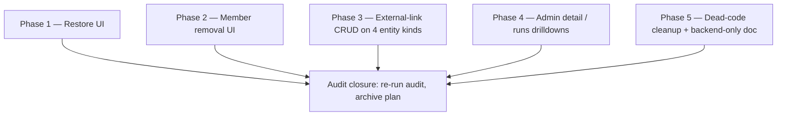

# UI exposure gaps

> Source: [`docs/dev/audits/ui-route-exposure-audit-2026-05-25.md`](../audits/ui-route-exposure-audit-2026-05-25.md).
> Status: open.
> Owner: cross-cutting (entity modules + admin).
> Mode: Large Change — touches every entity kind + admin surfaces.

## 1. Goal

Close the operational gaps surfaced by the 2026-05-25 route /
UI exposure audit. Every backend route that is intended for end
users or admins must have a reachable UI affordance. Routes that
are intentionally backend-only are documented as such.

After this plan ships, the audit re-run produces an empty
"backend routes with no web caller" table for user-facing /
admin-facing surfaces. Genuinely backend-only routes (event
ingest, cron callbacks, system actors) are listed explicitly in
`docs/dev/architecture/backend-only-endpoints.md`.

## 2. Scope

In scope (the audit gaps):

1. **Soft-delete restore UI** for all 5 entity kinds
   (company, contact, calendar_event, todo, whiteboard).
   `POST /l/:slug/<kind>/:slug/restore` exists; no UI calls it.
2. **Layer member removal UI**. `DELETE
/layers/:slug/members/:memberId` exists; Members tab only
   exposes add.
3. **External-link CRUD** on contact, calendar_event,
   whiteboard, todo. Only Companies has the affordance today;
   the routes (`POST` / `DELETE
.../entities/<kind>/:slug/external-links/...`) are wired but
   silent on every other entity's detail page.
4. **Admin omissions**:
   - `GET /admin/users/:id` — no `AdminUserDetailPage`.
   - `GET /admin/scheduled-tasks/:taskId/runs` — no client
     helper, no per-task runs drilldown.
5. **Dead code cleanup**:
   - `lib/api.ts::getLayer()` — defined, unused; remove or wire.
   - `GET /l/:slug/whiteboard/_stats` — auto-generated by the
     generic router, never consumed; document as backend-only
     or remove if cheap.

Non-goals:

- New entity kinds (covered by phases 12+).
- Restoring **hard-deleted** rows (out of scope — soft-delete
  only).
- Bulk restore / multi-select restore (a future affordance once
  the per-row restore UX lands).
- Migrating the existing Companies external-link UI pattern to a
  shared component **as part of this plan** — it can be
  extracted later; phase 3 just copies the pattern faithfully
  and notes the duplication for a future refactor follow-up.
- Admin observability views (LLM calls, chat runs, events,
  analytics) — separate plan
  [`admin-observability-viewer.md`](./admin-observability-viewer.md).

## 3. Approach

Each gap is independent and small. We bundle them into one plan
purely so the audit can be marked closed in a single pass. Each
phase is a Normal-Change-sized increment that can ship on its
own; nothing depends on a later phase.

Within each phase:

1. Add the API client helper(s) in `apps/web/src/lib/api.ts`.
2. Add or extend the page / dialog / button.
3. Wire i18n keys (`en` + `nl`).
4. Add telemetry only where the affordance is non-trivial
   (restore, member removal, external-link CRUD on a new entity
   kind — these can fail).
5. Add analytics for the new user actions (restore, remove
   member, add/remove external link on entity X).
6. Add tests at the level we already use for the matching
   entity (smoke + happy path).
7. Update relevant docs (user guides per entity, architecture
   notes for the soft-delete restore pattern).

## 4. Affected modules

- `apps/web/src/pages/CompaniesListPage.tsx` and the four other
  list pages (restore from list).
- `apps/web/src/pages/CompanyDetailPage.tsx` and the four other
  detail pages (external-link CRUD + restore-when-soft-deleted
  banner).
- `apps/web/src/pages/admin/AdminUsersPage.tsx` (add detail
  page + route).
- `apps/web/src/pages/admin/AdminScheduledTasksPage.tsx` (per-
  task runs drilldown).
- `apps/web/src/pages/GroupDetailPage.tsx` (member remove
  affordance — same pattern at the layer level too).
- `apps/web/src/App.tsx` (new admin routes).
- `apps/web/src/lib/api.ts` (helper additions; `getLayer()`
  cleanup).
- `apps/web/src/locales/{en,nl}.json`.
- `apps/server/src/http/routes/entity-router.ts`
  (`_stats` decision: keep + document, or drop the auto-mount).

No server-side code changes are required for phases 1–4 — every
endpoint already exists. Phase 5 may touch the generic router.

## 5. Phases

### Phase 1 — Soft-delete restore UI (est. 4h)

- List page filter: `?includeDeleted=1` toggle + visual
  "Deleted" badge on soft-deleted rows.
- Detail page: when the row is soft-deleted, show a banner
  with a `Restore` button (confirmation dialog with localized
  copy).
- API helper: `restoreEntity(layerSlug, kind, slug)`.
- Telemetry: `entity.<kind>.restore` (success / failure /
  latency).
- Analytics: `entity_restored` with `kind`, `layerSlug`.
- Tests: smoke for at least Companies + Whiteboards.

### Phase 2 — Layer member removal UI (est. 2h)

- Members tab row gets a destructive `Remove` button (per
  shadcn destructive-button conventions) with confirm dialog.
- Disable for self if the actor is the only owner; surface a
  helpful tooltip when disabled.
- API helper: `removeLayerMember(layerSlug, memberId)`.
- Telemetry: `layer.member.remove`.
- Analytics: `layer_member_removed`.
- Test: smoke.

### Phase 3 — External-link CRUD on contact / calendar / whiteboard / todo (est. 6h)

- Reuse the Companies external-link block as a starting point.
  Copy into a small `<EntityExternalLinks>` component under
  `apps/web/src/components/` and consume from the four detail
  pages.
- Each kind keeps its own i18n key namespace
  (`contact.externalLinks.add`, etc.) for clean removal later.
- Telemetry per kind: `entity.<kind>.external-link.add` /
  `.remove`.
- Analytics: `entity_external_link_added` /
  `entity_external_link_removed` with `kind`.
- Tests: smoke for each kind.
- Follow-up filed for promoting the component to a shared
  pattern if the wiring proves identical across all 5 entities.

### Phase 4 — Admin detail + runs drilldown (est. 5h)

- `AdminUserDetailPage`: profile + groups + recent layers
  visibility. Reuses the same `<AdminPageShell>` (extract from
  `AdminUsersPage` if not yet shared).
- `AdminScheduledTasksPage` row gets a "Runs" link
  → `AdminScheduledTaskRunsPage` listing the last N runs with
  status, duration, error column, JSON details expander.
- New i18n keys: `admin.users.detail.*`,
  `admin.scheduledTasks.runs.*`.
- Telemetry: no new emit — pure read views.
- Analytics: not needed (admin-only diagnostics).
- Tests: smoke routing + happy-path render.

### Phase 5 — Dead-code cleanup + backend-only documentation (est. 2h)

- Decide on `lib/api.ts::getLayer()`: delete (preferred — the
  list page covers the use case) **or** wire to a real caller.
  No third option (keep as dead export).
- Decide on `GET /l/:slug/whiteboard/_stats`:
  - Option A: drop the `_stats` auto-mount in the generic
    router for entity kinds that opt out; whiteboard opts out.
  - Option B: keep + document under
    `docs/dev/architecture/backend-only-endpoints.md` as
    "reserved for future widget".
  - Recommendation: A, because dead endpoints clutter the
    audit re-run.
- Create `docs/dev/architecture/backend-only-endpoints.md`
  listing every endpoint that is deliberately not in the UI
  (cron callbacks, worker-only handlers, system-actor routes).
  Future audits diff against this list.

### Closure

- Re-run the 2026-05-25 audit script /
  procedure; the "backend routes with no web caller" table
  must contain only entries from
  `backend-only-endpoints.md`.
- Move this plan to `docs/dev/plans/done/`.

## 6. Tests

- Smoke per phase as described.
- Existing entity tests must continue to pass — soft-delete
  visibility filter is opt-in (`?includeDeleted=1`), so default
  list behaviour does not change.
- New regression test: soft-deleted row not shown in default
  list, shown when filter on, restorable from detail page.

## 7. Docs impact

- `docs/user/features/{companies,contacts,calendar,todos,whiteboards}.md`:
  add "Restoring deleted X" section.
- `docs/user/features/companies.md` + new equivalents for the
  other four: external links section.
- `docs/user/features/layers.md`: removing members.
- `docs/dev/architecture/backend-only-endpoints.md`: new file.
- `docs/dev/audits/`: archive the closure re-run.

## 8. i18n impact

New keys per phase. All five entity kinds get parallel
`<kind>.restore.*` and `<kind>.externalLinks.*` namespaces.
Member-removal keys live under `layers.members.remove.*`.
Admin keys live under `admin.users.detail.*` and
`admin.scheduledTasks.runs.*`.

## 9. Accessibility impact

- Restore button: destructive-style with confirmation dialog
  (focus trap, ESC closes, focus returns to trigger).
- Remove-member button: same pattern.
- External-link CRUD: existing Companies pattern is already a11y-
  compliant; copy faithfully.
- Admin runs drilldown: table with column headers, sortable
  via keyboard; row expansion via button (not row-click only).

## 10. Security impact

- Restore must require the same permission as delete (server
  already enforces). UI hides the button when the actor lacks
  the permission.
- Member removal already authz-guarded server-side; UI hides for
  non-owners.
- External-link CRUD: same authz as for Companies; the UI
  inherits.
- No new auth flow.

## 11. Logging impact

No new logging conventions. Existing `[entity.<kind>]` console
prefix carries the restore / external-link events. Errors are
written to `events` with the kind in the event name.

## 12. Telemetry impact

New metric rows on existing tables:

- `events`: `entity.<kind>.restored`,
  `entity.<kind>.external-link.added` /
  `.removed`, `layer.member.removed`.

No new tables. No new high-cardinality dimensions.

## 13. Analytics impact

New events (with `kind` / `layerSlug` only — no content):

- `entity_restored`
- `entity_external_link_added`
- `entity_external_link_removed`
- `layer_member_removed`

Per `docs/dev/observability/analytics.md` rules.

## 14. Risks

- **Restoring a row that was soft-deleted before a schema
  migration** could produce an inconsistent row. Mitigation:
  server already validates the row against the current schema
  on restore; if it rejects, the UI shows the error.
- **External-link CRUD on calendar / whiteboard** could
  conflict with connector ingest (Google Calendar writes
  `entity_external_links` from upstream IDs). Mitigation: the
  existing Companies CRUD already coexists with PIM ingest;
  mirror that wiring + show a read-only banner for ingest-
  owned links.

## 15. Open questions

- None blocking. Phase 3 may split into 4× sub-tasklist rows
  if the per-kind work diverges.
